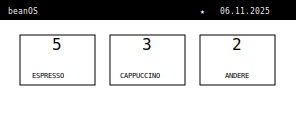
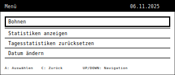
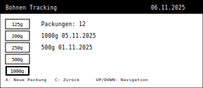
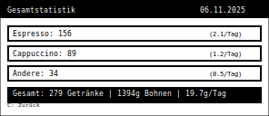
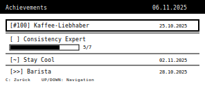
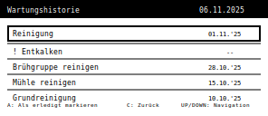
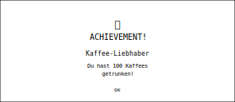

# beanOS

beanOS ist eine MicroPython-Anwendung für das Badger2040-Gerät. Sie verfolgt und protokolliert Ihren Kaffeekonsum mit Gamification-Features und bietet eine einfache Benutzeroberfläche zur Anzeige von Statistiken, zum Zurücksetzen von Zählern und zum Freischalten von Achievements.

Dieser Code darf nicht von Faschisten verwendet werden! Kein Code für die AfD, Musk oder Trump!

## ✨ Features

### ☕ Kaffee-Tracking
- Verfolgung von Espresso, Cappuccino und 6 zusätzlichen Getränketypen
- Tages-, Wochen- und Gesamtstatistiken
- Bohnenverbrauchsanalyse mit Packungsgrößen-Tracking
- Automatische Datenprotokollierung in CSV-Format
- Bean-Pack-Zähler mit Datum der letzten angebrochenen Packungen

### 🏆 Achievement-System
- **Meilenstein-Achievements**: Belohnungen für 1, 10, 50, 100, 500 und 1000 Kaffees
- **Streak-Achievements**: Halte deine Kaffeegewohnheit 7 oder 30 Tage am Laufenden
- **Spezialgetränke-Achievements**: Probiere neue Getränke wie Iced Latte, Affogato oder Shakerato
- **Wartungs-Achievements**: Halte deine Maschine in perfektem Zustand
- **Experimentelle Achievements**: Werde ein echter Barista, indem du alle Getränketypen probierst
- **Fortschrittsanzeige**: Visuelle Fortschrittsbalken für Streak-Achievements
- **Achievement-Benachrichtigungen**: Vollbild-Feiern beim Freischalten neuer Achievements
- **Achievement-Icon**: Täglicher Stern (★) in der Titelleiste bei freigeschalteten Achievements

### 🔧 Intelligentes Wartungssystem
- Automatische Wartungserinnerungen basierend auf Zeit und Nutzung
- 5 verschiedene Wartungstypen mit benutzerdefinierten Intervallen
- Visuelle Warnungen und schnelle Fertigstellungsprotokollierung
- Wartungshistorie mit Datum der letzten Durchführung

### 🎨 Moderne Benutzeroberfläche
- **Einheitliches Design**: Achievement-Style Layout mit schwarzen Titelbalken
- **Große, lesbare Schrift**: Optimiert für E-Ink-Display-Lesbarkeit
- **Intelligentes Scrolling**: Automatische Navigation in langen Menüs
- **Bitmap Icons**: Hochwertige 1-Bit-Bitmap-Icons für optimale E-Ink-Darstellung
- **Responsive Layout**: Optimale Nutzung des 296x128 Pixel Displays
- **SVG Icon Templates**: E-Ink-optimierte Icon-Vorlagen für Achievements und UI-Elemente ([Icon Gallery](icons/index.html))

## 📱 Screenshots der Menüs

### Hauptbildschirm


*Der Hauptbildschirm zeigt die täglichen Kaffeezähler in drei großen Boxen. Der Achievement-Stern (★) erscheint bei freigeschalteten Tageszielen.*

### Hauptmenü


*Das zentrale Navigationsmenü mit Achievement-Style Layout. Ausgewählte Optionen werden mit schwarzen Rahmen hervorgehoben.*

### Bohnen-Tracking-Menü


*Bean-Pack-Verfolgung mit verschiedenen Packungsgrößen. Zeigt Gesamtanzahl und die letzten beiden angebrochenen Packungen mit Datum.*

### Gesamtstatistik


*Detaillierte Verbrauchsstatistiken mit Tages-Durchschnittswerten und Bohnenverbrauchsanalyse.*

### Achievement-Menü


*Achievement-Übersicht mit Fortschrittsbalken für unvollständige Streak-Achievements und Datum für erreichte Meilensteine.*

### Wartungshistorie


*Wartungsaufgaben mit Status-Anzeige. Überfällige Wartungen werden mit "!" markiert.*

### Achievement-Benachrichtigung


*Vollbild-Feier beim Freischalten neuer Achievements mit Trophy-Symbol und Beschreibung.*

## 🎨 SVG Icon Templates & Bitmap Integration

beanOS enthält eine umfassende Sammlung von SVG-Icon-Vorlagen, die speziell für E-Ink-Displays optimiert wurden. Diese Icons wurden in 1-Bit-Bitmaps konvertiert und sind direkt in den Code integriert für optimale Darstellung auf dem Badger2040.

### Icon-Kategorien

- **Milestones** (6 Icons): #1, #10, #50, #100, #500, #1000
- **Streaks** (2 Icons): =7, =30
- **Special Drinks** (3 Icons): ~, o, %
- **Maintenance** (2 Icons): <>, []
- **Experimental** (2 Icons): >>, ^^
- **General** (1 Icon): ★

### Bitmap-Icon-System

Die Icons werden als 1-Bit-Bitmaps (32x32 Pixel) gespeichert und direkt auf dem Display gerendert:

- **Format**: Bytearray mit 4 Bytes pro Zeile (128 Bytes pro Icon)
- **Speicherung**: In `icon_bitmaps.py` als MicroPython-kompatible Bytearrays
- **Rendering**: Pixel-für-Pixel-Zeichnung mit der `draw_bitmap_icon()` Funktion
- **Verwendung**: Achievements-Benachrichtigungen, Achievement-Menü, Titelleiste

### Design-Prinzipien

Alle Icons folgen strengen Design-Richtlinien für optimale E-Ink-Darstellung:

- ✅ **Hoher Kontrast**: Nur Schwarz und Weiß, keine Gradienten
- ✅ **Einfache Geometrie**: Klare, kräftige Formen, die bei kleinen Größen gut lesbar sind
- ✅ **Konsistente Größe**: Alle Icons haben eine 32x32px ViewBox
- ✅ **Strichstärke**: Mindestens 2px Strichstärke für bessere Sichtbarkeit
- ✅ **E-Ink-optimiert**: Speziell für das Badger2040-Display (296x128px) entwickelt

### Icon-Galerie

Besuche die [Icon Gallery](icons/index.html) für eine vollständige Übersicht aller verfügbaren Icons mit Vorschau.

Weitere Details und technische Spezifikationen findest du in der [Icons README](icons/README.md).

## 🚀 Installation

So installieren Sie beanOS auf Ihrem Badger2040:

### Voraussetzungen
- Pimoroni Badger2040 mit MicroPython-Firmware
- Thonny IDE oder ähnliche MicroPython-Entwicklungsumgebung
- USB-Kabel für Geräteverbindung

### Installationsschritte
1. Verbinden Sie Ihr Badger2040 über USB mit Ihrem Computer
2. Öffnen Sie Thonny IDE und stellen Sie sicher, dass das Gerät erkannt wird
3. Kopieren Sie den Inhalt der `main.py`-Datei in Thonnys Editor
4. Speichern Sie die Datei auf Ihrem Badger2040 als `main.py`
5. Kopieren Sie die `icon_bitmaps.py`-Datei in das Stammverzeichnis Ihres Badger2040
6. Kopieren Sie die `maintenance_config.json`-Datei in das Stammverzeichnis Ihres Badger2040
7. Trennen Sie die Verbindung und starten Sie das Gerät neu

### Erforderliche Dateien
- **main.py** - Hauptanwendungscode
- **icon_bitmaps.py** - 1-Bit-Bitmap-Daten für Achievement-Icons
- **maintenance_config.json** - Wartungsaufgaben-Konfiguration

### Automatisch generierte Dateien
Die folgenden Dateien werden während der Nutzung automatisch erstellt:
- **kaffee_log.csv** - Datenprotokoll des Kaffeekonsums
- **achievements.json** - Verfolgung des Achievement-Fortschritts
- **maintenance_status.json** - Verfolgung der Wartungsabschlüsse
- **current_date.txt** - Persistierung des aktuellen Datums
- **current_counts.txt** - Backup der täglichen Zähler

## 🏗️ Technische Architektur

### Code-Struktur
Die Anwendung ist in folgende Hauptabschnitte gegliedert:
- **Hardware-Initialisierung** - Display, Tasten, LED-Setup
- **Dateiverwaltung** - Datenpersistierung und Konfiguration
- **Menüsystem** - Navigation und Benutzeroberfläche
- **Achievement-Engine** - Gamification und Fortschrittsverfolgung
- **Wartungssystem** - Automatisierte Erinnerungen und Protokollierung
- **Statistik-Engine** - Datenanalyse und Berichterstattung
- **Benachrichtigungssystem** - Benutzerwarnungen und Feiern

### Datenfluss
1. **Eingabe**: Tastendruck → `button_pressed()` Funktion
2. **Verarbeitung**: Zähler aktualisieren → Achievements prüfen → Wartung prüfen
3. **Speicherung**: In CSV-Protokoll und JSON-Statusdateien speichern
4. **Anzeige**: Bildschirm über `update_display()` Funktion aktualisieren

### Speicherverwaltung
- Minimaler RAM-Verbrauch für Embedded-Umgebung
- Effiziente Datei-I/O-Operationen
- Intelligente Display-Update-Strategien (TURBO vs NORMAL Modi)

## 📖 Bedienung

### Navigationsübersicht

**Von Hauptbildschirm zu:**
- **Getränkemenü**: Taste C drücken
- **Hauptmenü**: Taste UP drücken
- **Ruhemodus**: Taste DOWN drücken

**Von Hauptmenü zu:**
- **Bohnen-Tracking**: Menüpunkt "Bohnen" auswählen (Taste A)
- **Gesamtstatistik**: Menüpunkt "Statistiken anzeigen" auswählen (Taste A)
- **Wartungshistorie**: Menüpunkt "Wartungshistorie" auswählen (Taste A)
- **Achievements**: Menüpunkt "Achievements" auswählen (Taste A)
- **Zurück zum Hauptbildschirm**: Taste C drücken

**Von Untermenüs zurück:**
- **Alle Untermenüs**: Taste C drücken, um zum vorherigen Bildschirm zurückzukehren

### Hauptbildschirm
Der Hauptbildschirm zeigt die täglichen Kaffeezähler in drei großen Boxen an.

#### Tasten
- **A**: Erhöht den Espresso-Zähler
- **B**: Erhöht den Cappuccino-Zähler  
- **C**: Öffnet das Getränkemenü für zusätzliche Getränke
- **UP**: Öffnet das Hauptmenü
- **DOWN**: Schaltet das Gerät in den Ruhemodus

### Getränkemenü
Zusätzliche Getränketypen können über dieses Menü ausgewählt werden.

#### Tasten
- **A**: Wählt das ausgewählte Getränk aus
- **C**: Schließt das Menü
- **UP** & **DOWN**: Navigation im Menü

### Hauptmenü
Das zentrale Navigationsmenü mit allen Hauptfunktionen.

#### Tasten
- **A**: Wählt die ausgewählte Option aus
- **C**: Schließt das Menü  
- **UP** & **DOWN**: Navigation im Menü

#### Menüoptionen

- **Bohnen**: Öffnet das Bean-Pack-Tracking-Menü
- **Statistiken anzeigen**: Zeigt Gesamtzähler von Espresso, Cappuccino und anderen Getränken. Auch Bohnenverbrauch (Gramm pro Tag, Tage pro Packung) und durchschnittlicher Kaffee pro Tag.
- **Tagesstatistiken zurücksetzen**: Setzt die täglichen Zähler für Espresso, Cappuccino und andere Getränke zurück.
- **Datum ändern**: Ermöglicht die Änderung des aktuellen Datums.
- **Wartungshistorie**: Anzeige und manuelle Protokollierung von Wartungsaufgaben. Aufgabe auswählen und Taste A drücken, um sie für heute als erledigt zu markieren.
- **Achievements**: Zeige deine freigeschalteten Achievements organisiert nach Kategorien. Navigiere durch deine Kaffee-Errungenschaften und sieh Fortschrittsbalken für unvollständige Streak-Achievements.
- **Information**: Zeigt Versionsinformationen und Credits an.

## 🏆 Achievement-Kategorien

### 🏅 Meilensteine
Schalte Achievements für das Erreichen von Kaffeekonsum-Meilensteinen frei:
- **[#1] Erster Kaffee**: Dein allererster Kaffee!
- **[#10] Kaffee-Starter**: 10 Kaffees getrunken
- **[#50] Kaffee-Fan**: 50 Kaffees getrunken  
- **[#100] Kaffee-Liebhaber**: 100 Kaffees getrunken
- **[#500] Kaffee-Experte**: 500 Kaffees getrunken
- **[#1000] Kaffee-Meister**: 1000 Kaffees getrunken

### 🔥 Streaks
Halte deine Kaffeegewohnheit am Laufenden:
- **[=7] Consistency Expert**: 7 Tage in Folge Kaffee trinken
- **[=30] Consistency Master**: 30 Tage in Folge Kaffee trinken

### 🍹 Spezialgetränke
Erkunde neue Geschmackserlebnisse:
- **[~] Stay Cool**: Ersten Iced Latte getrunken
- **[o] Dessert**: Ersten Affogato getrunken
- **[%] Shake it!**: Ersten Shakerato getrunken

### 🔧 Wartung
Halte deine Maschine in Top-Zustand:
- **[<>] Saubere Maschine**: Erste Wartung durchgeführt
- **[[]] Wartungsmeister**: Alle Wartungen rechtzeitig durchgeführt

### 🧪 Experimentell
Für echte Kaffee-Enthusiasten:
- **[>>] Barista**: Alle Getränketypen probiert
- **[^^] Happy Bean Day**: 10 Kaffees an einem Tag

## 🔧 Wartungssystem

Das intelligente Wartungssystem von beanOS hilft dabei, Ihre Kaffeemaschine in optimalem Zustand zu halten:

### Wartungstypen
- **Reinigung**: Tägliche/wöchentliche Grundreinigung
- **Entkalken**: Regelmäßige Entkalkung basierend auf Wasserqualität
- **Brühgruppe reinigen**: Automatisch nach bestimmter Anzahl von Getränken
- **Mühle reinigen**: Regelmäßige Reinigung des Mahlwerks
- **Grundreinigung**: Umfassende Wartung in größeren Abständen

### Intelligente Erinnerungen
- **Zeitbasiert**: Erinnerungen basierend auf konfigurierbaren Tagesintervallen
- **Nutzungsbasiert**: Spezielle Logik für brühgruppenbasierte Wartung
- **Visuelle Indikatoren**: Warnungen in der Wartungshistorie und Titelleiste

## 📊 Bean-Pack-Tracking

Das Bean-Pack-System verfolgt Ihren Bohnenverbrauch und hilft beim Planen von Nachbestellungen:

### Features
- **Packungsgrößen**: 125g, 200g, 250g, 500g, 750g, 1000g
- **Zähler**: Gesamtanzahl angebrochener Packungen
- **Historie**: Datum der letzten beiden angebrochenen Packungen
- **Sofortige Aktualisierung**: Live-Update der Anzeige bei neuen Packungen

### Verwendung
1. Wählen Sie "Bohnen" im Hauptmenü
2. Navigieren Sie mit UP/DOWN zur gewünschten Packungsgröße
3. Drücken Sie A, um eine neue Packung zu registrieren
4. Das Menü bleibt offen für weitere Eingaben
5. Drücken Sie C zum Verlassen

## 🚀 Version 2.4.0 - Neue Features

### UI/UX-Verbesserungen
- **Große, lesbare Schrift**: Alle Menüs verwenden jetzt scale=2 für bessere Lesbarkeit
- **Einheitliches Design**: Achievement-Style Layout mit schwarzen Titelbalken überall
- **Intelligentes Scrolling**: Automatische Navigation in langen Listen
- **ASCII-kompatible Icons**: Vollständige Badger2040-Hardware-Kompatibilität

### Bean-Pack-System
- **Verbesserte Anzeige**: Gesamtanzahl + letzte zwei Packungen mit Datum
- **Persistent**: Menü bleibt nach Auswahl geöffnet für mehrere Eingaben
- **Sofort-Update**: Live-Aktualisierung der Statistiken

### Performance
- **Optimiertes Scrolling**: Effiziente Navigation in allen Menüs
- **Bessere Layouts**: Maximale Nutzung des verfügbaren Bildschirmplatzes
- **Stabilität**: Robuste Fehlerbehandlung und Speicherverwaltung

## 📝 Lizenz

GNU GPLv3 - Siehe LICENSE-Datei für Details.

## 👤 Autor

Joao Neisinger

## 🤝 Beitragen

Beiträge sind willkommen! Bitte öffnen Sie ein Issue oder erstellen Sie einen Pull Request.

## ⚠️ Wichtiger Hinweis

Dieser Code darf nicht von Faschisten verwendet werden! Kein Code für die AfD, Musk oder Trump!

#### ⚡ Streaks
Maintain consistent coffee consumption:
- **[7d] Wochenentkämpfer**: 7 days in a row with coffee
- **[30d] Monatsmarathon**: 30 days in a row with coffee
- *Progress bars show your current streak progress for incomplete achievements*

#### 🍹 Spezialgetränke (Special Drinks)
Try different coffee varieties:
- **[IC] Stay Cool**: First iced latte consumed
- **[AF] Dessert**: First affogato consumed
- **[SH] Shake it!**: First shakerato consumed

#### 🔧 Wartung (Maintenance)
Keep your machine in perfect condition:
- **[CL] Saubere Maschine**: First maintenance completed
- **[WM] Wartungsmeister**: All maintenance tasks completed on time

#### 🧪 Experimentell (Experimental)
Master the art of coffee:
- **[BA] Barista**: All drink types tried
- **[HB] Happy Bean Day**: 10 coffees in a single day

### Bean Packs
You can select the current pack size in the menu. The statistics will show how many days a pack lasts and your average bean consumption per day.

### Maintenance Reminders
beanOS includes an intelligent maintenance reminder system that helps you keep your coffee machine in optimal condition.

#### Features:
- **Automatic Warnings**: The system automatically shows full-screen warnings when maintenance tasks are due
- **Smart Icon**: When you dismiss a warning with Button C, a small "!" icon appears next to the date as a subtle reminder
- **Quick Action**: Press Button A on a maintenance warning to mark the current task as completed
- **Menu Integration**: Use the "Wartungshistorie" menu to manually log maintenance tasks
- **Auto-Reset**: The warning icon automatically disappears when you log a maintenance task through the menu

#### Maintenance Tasks:
- **Cleaning** (every 7 days)
- **Descaling** (every 28 days) 
- **Brew Group Cleaning** (every 42 days OR after 150 drinks)
- **Grinder Cleaning** (every 56 days)
- **Deep Cleaning** (every 365 days)

#### Button Controls for Maintenance:
- **Button A**: Mark the current maintenance task as completed
- **Button C**: Hide the warning and show the small reminder icon instead

## Changelog

## Development & Customization

### Adding New Achievements
1. Add achievement definition to `get_achievement_definitions()`
2. Implement check logic in `check_achievements()`
3. Test with achievement notification system

### Modifying Maintenance Tasks
Edit `maintenance_config.json`:
```json
{
  "tasks": [
    {"name": "cleaning", "interval": 7},
    {"name": "brew_group_cleaning", "interval": 42, "drink_limit": 150}
  ]
}
```

### Configuration Options
- **Display Update Modes**: TURBO (fast) vs NORMAL (full refresh)
- **Achievement Categories**: Milestones, Streaks, Special, Maintenance, Experimental
- **Button Debouncing**: 0.2 second default debounce time
- **Auto-Sleep**: 15 seconds of inactivity

### Debug Features
- Console output for achievement debugging
- Error display system for configuration issues
- Achievement progress logging

### Performance Considerations
- Use TURBO display updates for frequent refreshes
- Minimize file I/O operations during active use
- Efficient CSV parsing for large log files
- Smart achievement checking (only when needed)

## Troubleshooting

### Common Issues
1. **"maintenance_config.json nicht gefunden"**
   - Ensure the file exists in the root directory
   - Check JSON syntax validity

2. **Achievements not unlocking**
   - Check console output for debug information
   - Verify achievement logic in `check_achievements()`

3. **Display not updating**
   - Force full refresh with `update_display(True)`
   - Check display update speed settings

4. **Data loss on restart**
   - Verify file write permissions
   - Check for corrupted JSON files

### File Recovery
If data files become corrupted:
1. Delete corrupted `.json` files (they will be recreated)
2. Backup `kaffee_log.csv` before any major changes
3. Use debug console to verify data integrity

## Changelog

### v2.4.1 (Current)
- 🎨 **New**: 1-Bit Bitmap Icon System
- ✅ Converted all 16 SVG icons to 1-bit bitmaps (32x32 pixels)
- ✅ Integrated bitmap icons into main.py for native rendering
- ✅ Created icon_bitmaps.py module with pre-rendered icon data
- ✅ Updated achievement notifications to display bitmap icons
- ✅ Updated achievement menu to show bitmap icons
- ✅ Updated title bar achievement star with bitmap rendering
- 📝 **Improved**: Icon display quality on E-Ink screen
- 🚀 **Performance**: Direct bitmap rendering without font dependencies

### v2.4.0
- 📝 **Documentation**: Enhanced README with bitmap icon documentation
- 🎨 **UI**: Large, readable fonts across all menus (scale=2)
- 🏗️ **Layout**: Achievement-style design with black title bars

### v2.3.3
- 📝 **Documentation**: Comprehensive code documentation and comments
- 🏗️ **Architecture**: Improved code structure and organization  
- 📖 **README**: Extended technical documentation for developers
- 🔧 **Code Quality**: Added docstrings and inline comments throughout

### v2.3.2
- 📝 **Achievement Renaming**
- ✅ "Wochenentkämpfer" → "Consistency Expert" (7-day streak)
- ✅ "Monatsmarathon" → "Consistency Master" (30-day streak)

### v2.3.1
- 🐛 **Fixed**: Button B now correctly increments cappuccino count
- 🏆 **Improved**: Achievement checking for cappuccino button restored

### v2.3.0 
- 🏆 **New**: Complete achievement system with 20+ achievements
- 🔧 **New**: Smart maintenance reminders with visual warnings
- 📊 **Improved**: Enhanced statistics and tracking

## License

This project is licensed under the GNU GPLv3 License. See the LICENSE file for details.

## Author

Joao Neisinger
