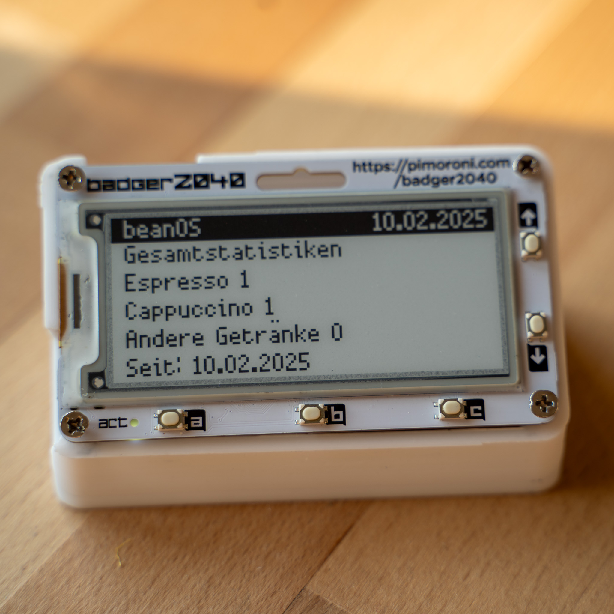
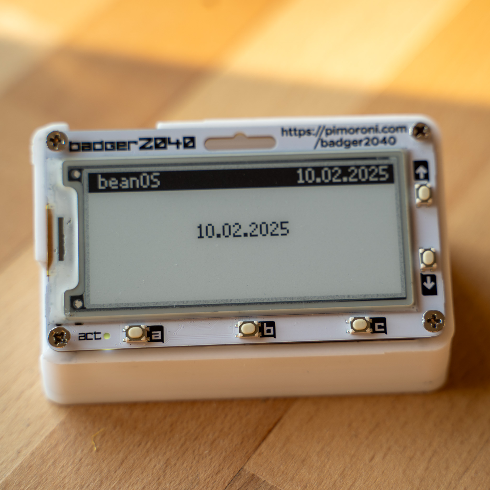
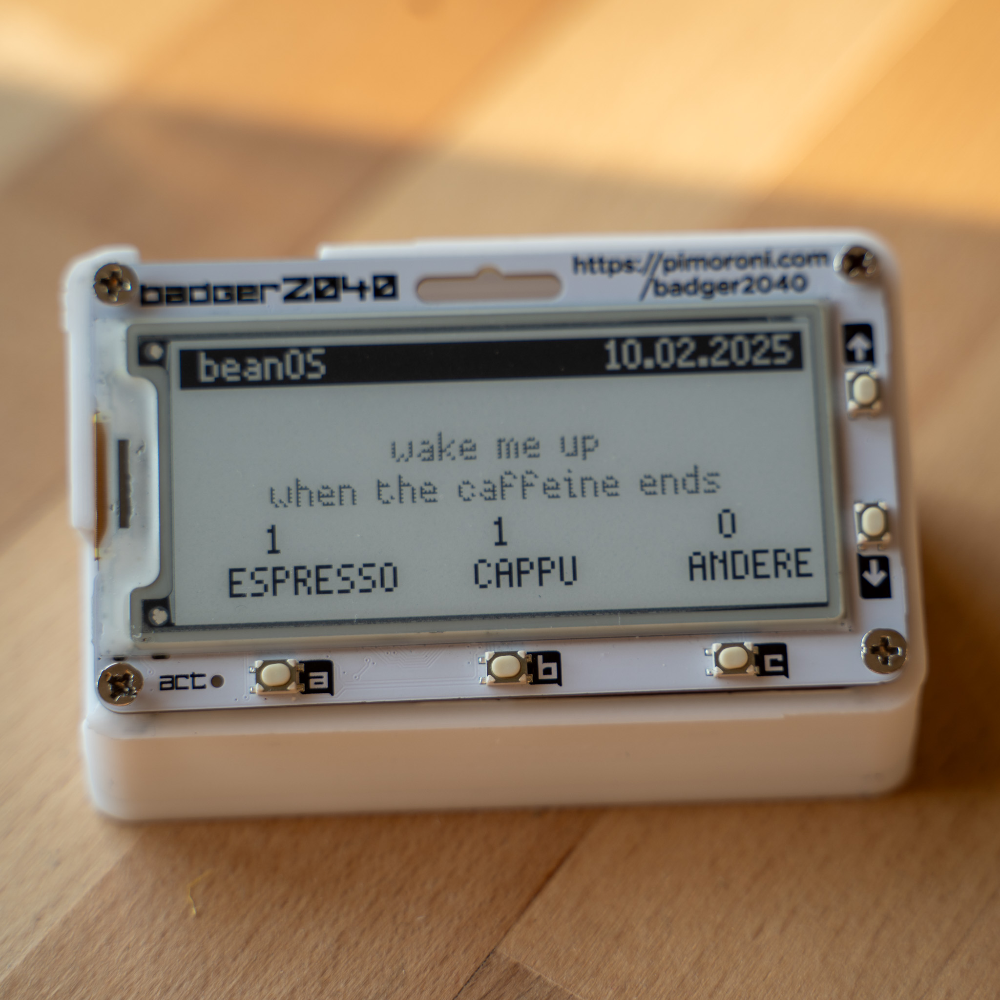

<div align="center">

# ☕ beanOS

**Das ultimative Kaffee-Tracking-System für Badger2040**

[](https://www.gnu.org/licenses/gpl-3.0)
[](https://shop.pimoroni.com/products/badger-2040)
[](https://micropython.org/)
[](https://github.com/neisinger/beanOS)

*Verfolge deine Kaffee-Reise stilvoll auf deinem E-Ink-Display*


[Features](#-features) • [Installation](#-installation) • [Verwendung](#-verwendung) • [Screenshots](#-screenshots-galerie) • [Datenverwaltung](#️-datenverwaltung)

</div>

---

## 📖 Über beanOS

**beanOS** ist eine funktionsreiche MicroPython-Anwendung, die speziell für das **Badger2040** E-Ink-Display entwickelt wurde. Verwandle deine Kaffeeroutine in ein spannendes Erlebnis mit umfassendem Tracking, Gamification und Wartungserinnerungen.

Ob du gelegentlich Kaffee trinkst oder ein begeisterter Espresso-Enthusiast bist, beanOS hilft dir:
- 📊 Jede Tasse mit detaillierten Statistiken zu verfolgen
- 🏆 Erfolge freizuschalten und Serien aufzubauen
- 🔧 Deine Kaffeemaschine richtig zu warten
- 📈 Deine Konsummuster zu analysieren

### 🚫 Anti-Faschismus-Erklärung
Dieser Code darf nicht von Faschisten verwendet werden! Kein Code für die AfD oder Musk oder Trump!

---

## ✨ Features

<table>
<tr>
<td width="33%" valign="top">

### ☕ Kaffee-Tracking
- **8 Getränkearten**: Espresso, Cappuccino, Lungo, Eiskaffee, Affogato, Shakerato, Espresso Tonic und mehr
- **Intelligente Statistiken**: Tägliches, wöchentliches und lebenslanges Tracking
- **Bohnenanalyse**: Verbrauch pro Tag, Tage pro Packung
- **Automatisches Logging**: Alle Daten im CSV-Format gespeichert
- **Anpassbare Packungen**: Mehrere Bohnenpackungsgrößen (125g-1000g)

</td>
<td width="33%" valign="top">

### 🏆 Erfolge-System
- **20+ Erfolge** in 5 Kategorien
- **Meilenstein-Belohnungen**: 1, 10, 50, 100, 500, 1000 Kaffees
- **Serien-Tracking**: 7-Tage- und 30-Tage-Konsistenz
- **Spezialgetränke**: Freischalten durch Probieren neuer Getränke
- **Wartungsmeister**: Belohnungen für Maschinenpflege
- **Fortschrittsbalken**: Visuelles Feedback zu Zielen
- **Täglicher Stern**: Titelleisten-Indikator (★) für Freischaltungen
- **Vollbild-Feierlichkeiten**: Animierte Benachrichtigungen

</td>
<td width="33%" valign="top">

### 🔧 Intelligente Wartung
- **5 Wartungsarten**: Reinigung, Entkalkung, Brühgruppe, Mühle, Tiefenreinigung
- **Doppelte Auslöser**: Zeitbasiert UND nutzungsbasiert
- **Visuelle Warnungen**: Vollbildmeldungen bei Fälligkeit
- **Schnellaktion**: Ein-Knopf-Aufgabenabschluss
- **Intelligente Erinnerungen**: Dauerhaftes Symbol (!<) bis zur Lösung
- **Vollständiger Verlauf**: Alle Wartungsaktivitäten nachverfolgen
- **Automatisches Zurücksetzen**: Warnungen werden nach Abschluss gelöscht

</td>
</tr>
</table>

---

## 📦 Was wird benötigt?

### Hardware-Anforderungen
- **Badger2040** E-Ink-Display von Pimoroni
- USB-Kabel für Verbindung und Stromversorgung
- Computer mit Thonny IDE (oder ähnlicher MicroPython-Entwicklungsumgebung)

### Software-Anforderungen
- **MicroPython** Firmware (Version 1.19 oder höher)
- **Thonny IDE** (empfohlen) oder ein beliebiger MicroPython-kompatibler Editor

---

## 🚀 Installation

### Schnellstart (5 Minuten)

<details>
<summary><b>Schritt 1: Bereite deinen Badger2040 vor</b></summary>

1. Stelle sicher, dass dein Badger2040 MicroPython-Firmware installiert hat
2. Verbinde ihn per USB-Kabel mit deinem Computer
3. Das Gerät sollte als Speichergerät erscheinen

</details>

<details>
<summary><b>Schritt 2: Installiere Thonny IDE</b></summary>

1. Lade Thonny von [thonny.org](https://thonny.org/) herunter
2. Installiere und starte die Anwendung
3. Gehe zu **Werkzeuge** → **Optionen** → **Interpreter**
4. Wähle "MicroPython (Raspberry Pi Pico)" als Interpreter
5. Wähle den richtigen COM-Port für deinen Badger2040

</details>

<details>
<summary><b>Schritt 3: Kopiere Dateien auf den Badger2040</b></summary>

1. Lade dieses Repository herunter oder klone es
2. Öffne `main.py` in Thonny IDE
3. Klicke auf **Datei** → **Speichern unter**
4. Wähle **Raspberry Pi Pico** (dein Badger2040)
5. Speichere die Datei als `main.py`
6. Wiederhole den Vorgang für `maintenance_config.json`

**Erforderliche Dateien:**
- ✅ `main.py` - Hauptanwendungscode
- ✅ `maintenance_config.json` - Wartungskonfiguration

**Optionale Dateien (werden automatisch erstellt):**
- `kaffee_log.csv` - Kaffee-Konsumprotokoll
- `current_date.txt` - Aktuelle Datumsverfolgung
- `current_counts.txt` - Tägliche Zähler
- `achievements.json` - Erfolgsfortschritt
- `maintenance_status.json` - Wartungsverlauf

</details>

<details>
<summary><b>Schritt 4: Erster Start</b></summary>

1. Trenne und verbinde deinen Badger2040 erneut (oder drücke den Reset-Knopf)
2. Die beanOS-Oberfläche sollte auf dem E-Ink-Bildschirm erscheinen
3. Beginne, deinen Kaffee zu tracken! ☕

</details>

### Alternative Installationsmethoden

#### Mit `mpremote`
```bash
mpremote cp main.py :main.py
mpremote cp maintenance_config.json :maintenance_config.json
```

#### Mit `ampy`
```bash
ampy --port /dev/ttyACM0 put main.py
ampy --port /dev/ttyACM0 put maintenance_config.json
```

---

## 🎮 Verwendung

### 🏠 Hauptbildschirm


Der Hauptbildschirm ist deine Kaffee-Tracking-Zentrale. Er zeigt:
- 📅 Aktuelles Datum mit Erfolgs-Indikator (★)
- ☕ Tägliche Espresso-Anzahl
- 🥛 Tägliche Cappuccino-Anzahl  
- 🌟 Tägliche andere Getränke-Anzahl
- ⚠️ Wartungserinnerungssymbol (!) wenn Aufgaben fällig sind

#### Tastensteuerung

| Taste | Aktion |
|--------|--------|
| **A** | Espresso-Anzahl erhöhen (+1 ☕) |
| **B** | Cappuccino-Anzahl erhöhen (+1 🥛) |
| **C** | Getränkemenü für andere Getränke öffnen |
| **HOCH ⬆** | Hauptmenü öffnen |
| **RUNTER ⬇** | Zum nächsten Tag wechseln (setzt tägliche Zähler zurück) |

---

### 🍵 Getränkemenü


Greife auf 6 zusätzliche Spezialgetränke neben Espresso und Cappuccino zu:

**Verfügbare Getränke:**
1. 🥃 **Lungo** - Verlängerter Espresso-Shot
2. 🧊 **Eiskaffee** - Kalte Kaffeeperfektion
3. 🍨 **Affogato** - Espresso trifft Eiscreme
4. 🥤 **Shakerato** - Geschüttelter Eiskaffee-Espresso
5. 🍋 **Espresso Tonic** - Erfrischende Kaffee-Limonade
6. ❓ **Andere** - Eigene Kreationen

#### Tastensteuerung

| Taste | Aktion |
|--------|--------|
| **A** | Markiertes Getränk auswählen |
| **C** | Menü schließen (zurück zum Hauptbildschirm) |
| **HOCH ⬆ / RUNTER ⬇** | Getränkeoptionen navigieren |

---

### 📋 Hauptmenü


Greife auf alle beanOS-Funktionen über das Hauptmenü zu:

#### Menüoptionen

| Option | Beschreibung |
|--------|-------------|
| **🌰 Bohnen** | Schnellzugriff auf das Getränkemenü (wie Taste C) |
| **📊 Statistiken anzeigen** | Umfassende Statistiken und Analysen anzeigen |
| **🔄 Tagesstatistiken zurücksetzen** | Heutige Getränkezähler auf null setzen |
| **📅 Datum ändern** | Aktuelles Datum manuell anpassen |
| **🔧 Wartungshistorie** | Wartungsaufgaben anzeigen und protokollieren |
| **🏆 Achievements** | Freigeschaltete Erfolge und Fortschritt durchsuchen |
| **ℹ️ Information** | Versionsinformationen und Credits |

#### Tastensteuerung

| Taste | Aktion |
|--------|--------|
| **A** | Markierte Menüoption auswählen |
| **C** | Menü schließen (zurück zum Hauptbildschirm) |
| **HOCH ⬆ / RUNTER ⬇** | Menüoptionen navigieren |

---

### 📊 Statistikansicht

Greife auf detaillierte Analysen über deinen Kaffeekonsum zu:

**Gesamtzähler:**
- Gesamter konsumierter Espresso
- Gesamter konsumierter Cappuccino
- Gesamte andere Getränke
- **Gesamtsumme** aller Getränke

**Bohnenanalyse:**
- Durchschnittliche Bohnen pro Tag (in Gramm)
- Verbleibende Tage in aktueller Packung
- Durchschnittliche Kaffees pro Tag
- Packungsgrößenauswahl (125g-1000g)

**Nutzungsmuster:**
- Tägliche Trends
- Wöchentlicher Konsum
- Beliebte Getränkearten

*Tipp: Drücke Taste C, um zwischen verschiedenen Statistikseiten umzuschalten*

---

### 🏆 Erfolge-System

Mach deine Kaffee-Reise zum Spiel mit **über 20 einzigartigen Erfolgen** in 5 Kategorien!

#### 🏅 Erfolgs-Kategorien

<details open>
<summary><b>Meilensteine</b> - Kaffeekonsum-Meilensteine</summary>

Schalte diese frei, während du dein Kaffee-Portfolio aufbaust:

| Erfolg | Symbol | Anforderung | Beschreibung |
|-------------|------|-------------|-------------|
| **Erster Kaffee** | [1] | 1 Kaffee | Dein allererster Kaffee! |
| **Kaffee-Starter** | [10] | 10 Kaffees | Du entwickelst eine Gewohnheit |
| **Kaffee-Fan** | [50] | 50 Kaffees | Jetzt bist du ein Fan! |
| **Kaffee-Liebhaber** | [100] | 100 Kaffees | Echter Kaffeeliebhaber |
| **Kaffee-Experte** | [500] | 500 Kaffees | Kaffeeexperten-Level |
| **Kaffee-Meister** | [1K] | 1000 Kaffees | Kaffeemeister erreicht! |

</details>

<details>
<summary><b>⚡ Serien</b> - Konsistenz-Erfolge</summary>

Baue deine tägliche Kaffeeroutine auf:

| Erfolg | Symbol | Anforderung | Fortschritt |
|-------------|------|-------------|----------|
| **Wochenentkämpfer** | [7d] | 7 aufeinanderfolgende Tage | Visueller Fortschrittsbalken |
| **Monatsmarathon** | [30d] | 30 aufeinanderfolgende Tage | Visueller Fortschrittsbalken |

*Fortschrittsbalken zeigen deine aktuelle Serie für unvollständige Erfolge*

</details>

<details>
<summary><b>🍹 Spezialgetränke</b> - Vielfalt-Erfolge</summary>

Erkunde verschiedene Kaffeeerlebnisse:

| Erfolg | Symbol | Anforderung | Beschreibung |
|-------------|------|-------------|-------------|
| **Stay Cool** | [IC] | Erster Eiskaffee | Erfrischende Wahl! |
| **Dessert** | [AF] | Erster Affogato | Süße Versuchung |
| **Shake it!** | [SH] | Erster Shakerato | Perfekt gekühlt |

</details>

<details>
<summary><b>🔧 Wartung</b> - Maschinenpflege-Erfolge</summary>

Halte deine Ausrüstung in Top-Form:

| Erfolg | Symbol | Anforderung | Beschreibung |
|-------------|------|-------------|-------------|
| **Saubere Maschine** | [CL] | Erste Wartung | Gute Gewohnheiten beginnen |
| **Wartungsmeister** | [WM] | Alle Aufgaben pünktlich | Wartungsmeister! |

</details>

<details>
<summary><b>🧪 Experimentell</b> - Besondere Erfolge</summary>

Meistere die Kunst des Kaffees:

| Erfolg | Symbol | Anforderung | Beschreibung |
|-------------|------|-------------|-------------|
| **Barista** | [BA] | Alle Getränkearten probieren | Du hast alles probiert! |
| **Happy Bean Day** | [HB] | 10 Kaffees an einem Tag | Koffein-Champion! |

</details>

#### 🎉 Erfolgs-Features

- **Vollbild-Feierlichkeiten**: Animierte Benachrichtigungen beim Freischalten von Erfolgen
- **Täglicher Indikator**: Stern (★) erscheint in der Titelleiste an Tagen, an denen du Erfolge freischaltest
- **Fortschrittsverfolgung**: Visuelle Fortschrittsbalken für Serien-Erfolge
- **Kategorien-Organisation**: Erfolge nach Typ gruppiert für einfaches Durchsuchen
- **Permanente Speicherung**: Alle Erfolge in `achievements.json` gespeichert

---

### 🔧 Wartungssystem

Halte deine Kaffeemaschine in optimalem Zustand mit beanOS's intelligentem Wartungserinnerungssystem.

#### 📋 Wartungsaufgaben

beanOS verfolgt 5 wesentliche Wartungsaufgaben:

| Aufgabe | Intervall | Auslösertyp | Beschreibung |
|------|----------|--------------|-------------|
| **☕ Reinigung** | 7 Tage | Zeitbasiert | Regelmäßige Maschinenreinigung |
| **💧 Entkalkung** | 28 Tage | Zeitbasiert | Mineralablagerungen entfernen |
| **🔩 Brühgruppenreinigung** | 42 Tage ODER 150 Getränke | Zeit + Nutzung | Tiefe Komponentenreinigung |
| **⚙️ Mühlenreinigung** | 56 Tage | Zeitbasiert | Mühle frisch halten |
| **🧹 Tiefenreinigung** | 365 Tage | Zeitbasiert | Jährliche gründliche Reinigung |

#### 🎯 So funktioniert es

1. **Automatische Überwachung**: beanOS verfolgt die verstrichene Zeit und konsumierten Getränke für jede Aufgabe
2. **Intelligente Warnungen**: Vollbildwarnungen erscheinen, wenn Wartung fällig ist
3. **Schnellaktion**: Drücke **Taste A** bei einer Warnung, um die Aufgabe als erledigt zu markieren
4. **Dauerhafte Erinnerungen**: Warnsymbol (!) erscheint neben dem Datum, wenn du die Warnung abweist
5. **Manuelle Protokollierung**: Greife auf das Menü "Wartungshistorie" zu, um Wartungen manuell zu protokollieren

#### 🖥️ Wartungsoberfläche

**Warnbildschirm-Features:**
- Klarer Aufgabenname und Beschreibung
- Zeit seit letzter Wartung
- Getränkeanzahl (für nutzungsbasierte Aufgaben)
- Schneller Abschluss mit Taste A
- Abweisungsoption mit Taste C

**Wartungshistorie-Menü:**
- Alle Wartungsaufgaben anzeigen
- Letztes Abschlussdatum für jede anzeigen
- Jede Aufgabe manuell protokollieren
- Wartungsmuster verfolgen

#### ⚡ Schnelltipps

- ✅ Weise Warnungen mit **Taste C** ab, um ein dezentes Erinnerungssymbol zu sehen
- ✅ Erledige Aufgaben direkt von Warnungen mit **Taste A**
- ✅ Verwende das Menü für manuelle Protokollierung, wenn du Aufgaben offline erledigst
- ✅ Das Symbol verschwindet automatisch, wenn du die Aufgabe protokollierst

---

### 📦 Bohnenpackungsverwaltung

Verfolge deinen Bohnenverbrauch und optimiere Bestellungen:

**Unterstützte Packungsgrößen:**
- 125g (kleine Packungen)
- 200g (Reisegröße)
- 250g (Standard klein)
- 500g (mittel)
- 750g (groß)
- 1000g (Bulk/Gewerblich)

**Bereitgestellte Analysen:**
- Gramm Bohnen pro Tag verwendet
- Verbleibende Tage in aktueller Packung
- Durchschnittliche Verbrauchsrate
- Voraussichtliches Nachbestelldatum

*Tipp: Wähle deine Packungsgröße im Statistikmenü für genaues Tracking*

---

## 📸 Screenshots-Galerie

<div align="center">

### Hauptoberfläche
 

*Links: Haupt-Tracking-Bildschirm | Rechts: Spezialgetränkemenü*

### Menüs & Features
 

*Links: Hauptmenü | Rechts: Statistikansicht*

### Zusätzliche Bildschirme
 

*Verschiedene Oberflächen-Bildschirme mit verschiedenen Features*

</div>

---

## 🗂️ Datenverwaltung

### Dateistruktur

beanOS erstellt und pflegt mehrere Dateien auf deinem Badger2040:

```
/ (root)
├── main.py                    # Hauptanwendung (ERFORDERLICH)
├── maintenance_config.json    # Wartungseinstellungen (ERFORDERLICH)
├── kaffee_log.csv            # Kaffee-Konsumprotokoll
├── current_date.txt          # Aktuelle Datumsverfolgung
├── current_counts.txt        # Tägliche Getränkezähler
├── achievements.json         # Erfolgsfortschritt
└── maintenance_status.json   # Wartungsverlauf
```

### CSV-Datenformat

Die Datei `kaffee_log.csv` protokolliert alle deine Kaffeedaten:

```csv
Date,Espresso,Cappuccino,Lungo,Iced Latte,Affogato,Shakerato,Espresso Tonic,Other
2024-01-15,3,2,0,1,0,0,0,0
2024-01-16,2,1,1,0,0,0,0,0
```

**Features:**
- Automatische Protokollierung bei jedem Getränk
- Kompatibel mit Excel, Google Sheets, Python pandas
- Perfekt für externe Analysen und Visualisierungen
- Nur-Anhängen-Format bewahrt den Verlauf

### Datenexport

Du kannst deine Daten exportieren, indem du:
1. Badger2040 mit deinem Computer verbindest
2. `kaffee_log.csv` auf deinen Desktop kopierst
3. In Tabellenkalkulationssoftware oder Datenanalyse-Tools öffnest

---

## ⚙️ Konfiguration

### Wartungskonfiguration

Bearbeite `maintenance_config.json`, um Wartungspläne anzupassen:

```json
{
  "tasks": [
    {
      "name": "Cleaning",
      "interval_days": 7,
      "usage_trigger": null
    },
    {
      "name": "Brew Group Cleaning",
      "interval_days": 42,
      "usage_trigger": 150
    }
  ]
}
```

**Parameter:**
- `name`: Anzeigename der Aufgabe
- `interval_days`: Tage zwischen erforderlicher Wartung
- `usage_trigger`: Optionaler Getränkezahl-Auslöser (null wenn nicht verwendet)

---

## 🎯 Tipps & Tricks

### Maximiere dein beanOS-Erlebnis

#### 🏆 Erfolg-Jagd
- **Konsistenz ist der Schlüssel**: Täglicher Kaffee baut Serien auf
- **Probiere alles**: Experimentiere mit allen Getränkearten für den Barista-Erfolg
- **Plane voraus**: Ziele auf Happy Bean Day am Wochenende
- **Warte regelmäßig**: Einfache Erfolge durch Maschinenpflege

#### 📊 Bessere Statistiken
- **Setze die richtige Packungsgröße**: Genaues Bohnenverbrauchs-Tracking
- **Tägliche Protokollierung**: Verwende die RUNTER-Taste, um Tage vorzurücken
- **Regelmäßige Synchronisierung**: Exportiere CSV-Daten wöchentlich zur Sicherung

#### 🔋 Batterieoptimierung
- E-Ink-Displays verwenden minimale Energie
- Batterie kann bei einer einzigen Ladung Wochen halten
- Deaktiviere LED-Benachrichtigungen bei Bedarf (Code bearbeiten)

#### 🔧 Wartungs-Best-Practices
- **Ignoriere keine Warnungen**: Die Langlebigkeit der Maschine hängt davon ab
- **Protokolliere sofort**: Verwende Taste A für schnellen Abschluss
- **Verfolge Muster**: Überprüfe den Verlauf, um Zeitpläne zu optimieren

---

## 🆘 Fehlerbehebung

<details>
<summary><b>Bildschirm aktualisiert sich nicht nach Tastendruck</b></summary>

**Lösung:**
1. Überprüfe den Batteriestand (möglicherweise Laden erforderlich)
2. Drücke den Reset-Knopf am Badger2040
3. Verifiziere, dass main.py im Root-Verzeichnis ist
4. Verbinde USB erneut und überprüfe Thonny-Ausgabe auf Fehler

</details>

<details>
<summary><b>maintenance_config.json-Fehler beim Start</b></summary>

**Lösung:**
1. Verifiziere, dass die Datei korrekt auf Badger2040 kopiert wurde
2. Überprüfe JSON-Syntax (verwende Online-JSON-Validator)
3. Stelle sicher, dass die Datei genau `maintenance_config.json` heißt
4. Kopiere die Datei erneut aus dem Repository

</details>

<details>
<summary><b>Erfolge werden nicht freigeschaltet</b></summary>

**Lösung:**
1. Überprüfe, ob achievements.json-Datei existiert
2. Verifiziere, dass Getränkezahlen gespeichert werden
3. Versuche, einen einfachen Erfolg freizuschalten (erster Kaffee)
4. Setze Erfolgsdatei zurück, wenn beschädigt (lösche achievements.json)

</details>

<details>
<summary><b>Datum/Uhrzeit inkorrekt</b></summary>

**Lösung:**
1. Verwende "Datum ändern" im Hauptmenü
2. Oder bearbeite current_date.txt direkt
3. Format: YYYY-MM-DD

</details>

<details>
<summary><b>CSV-Datei wird nicht erstellt</b></summary>

**Lösung:**
1. Überprüfe verfügbaren Speicher auf Badger2040
2. Verifiziere Schreibberechtigungen (einige Firmwares variieren)
3. Lösche und erstelle von Grund auf neu
4. Prüfe auf Dateisystemfehler

</details>

---

## ❓ FAQ

**F: Kann ich beanOS mit anderen E-Ink-Displays verwenden?**  
A: beanOS ist speziell für Badger2040 entwickelt. Die Portierung auf andere Displays würde erhebliche Code-Änderungen erfordern.

**F: Wie viel Speicher verwendet beanOS?**  
A: Die main.py ist ~56KB groß. Protokolldateien wachsen langsam (wenige Bytes pro Tag). Typische Nutzung: <100KB gesamt.

**F: Kann ich Tee oder andere Getränke verfolgen?**  
A: Ja! Die Kategorie "andere" und benutzerdefinierte Getränke können für jedes Getränk umfunktioniert werden.

**F: Wie exportiere ich Daten?**  
A: Verbinde Badger2040 mit dem Computer und kopiere die CSV-Datei.

**F: Wie setze ich alle Daten zurück?**  
A: Lösche alle generierten Dateien (behalte main.py und maintenance_config.json), dann starte neu.

**F: Können mehrere Personen ein beanOS-Gerät teilen?**  
A: Aktuell keine Mehrbenutzerunterstützung. Erwäge die Verwendung verschiedener CSV-Dateien für jeden Benutzer.

**F: Wie genau ist die Bohnenverbrauchsberechnung?**  
A: Basierend auf Standard-Espresso-Verhältnissen (7g Espresso, 14g Cappuccino). Passe an, wenn deine Maschine abweicht.

---

## 🛣️ Roadmap

### Geplant für v2.4
- 🔋 **Batterieindikator**: Echtzeit-Batterieanzeige
- 📈 **Heatmap-Visualisierung**: Kalenderartige Konsumheatmap
- 📊 **Erweiterte Analysen**: Wochentagsmuster, Trendanalyse
- 🏆 **Verbesserte Erfolge**: Schwierigkeitsgrade, monatliche Herausforderungen

### Zukünftige Ideen (v2.5+)
- 🎨 Anpassbare Themes
- 📊 Erweiterte Statistik-Visualisierungen

Siehe [ROADMAP.md](ROADMAP.md) für detaillierte Planung.

---

---

## 📝 Changelog

### v2.3.1 (Aktuell)
- 🐛 **Behoben**: Taste B erhöht jetzt korrekt die Cappuccino-Anzahl
- 🏆 **Verbessert**: Erfolgsüberprüfung für Cappuccino-Taste wiederhergestellt

### v2.3.0 
- 🏆 **Neu**: Vollständiges Erfolg-System mit über 20 Erfolgen
- 🔧 **Neu**: Intelligente Wartungserinnerungen mit visuellen Warnungen
- 📊 **Verbessert**: Erweiterte Statistiken und Tracking

### v2.2.x
- 📊 Bohnenverbrauchs-Analysen
- 📦 Mehrere Packungsgrößen-Unterstützung
- 🍹 Erweitertes Getränkemenü (6 Spezialgetränke)

### v2.1.x
- 🎯 Grundlegendes Tracking-System
- 📈 Einfache Statistiken
- 💾 CSV-Protokollierung

### v2.0.0
- 🎉 Erste öffentliche Veröffentlichung
- ☕ Espresso- und Cappuccino-Tracking
- 📅 Datumsverwaltung

---

## 🤝 Mitwirken

Wir freuen uns über Beiträge zu beanOS! So kannst du helfen:

### Wege zum Mitwirken

- 🐛 **Fehler melden**: Öffne ein Issue mit detaillierten Reproduktionsschritten
- 💡 **Features vorschlagen**: Teile deine Ideen im Issues-Bereich
- 📖 **Dokumentation verbessern**: Tippfehler beheben, Beispiele hinzufügen, Anweisungen klären
- 💻 **Code einreichen**: Forken, entwickeln und Pull Requests einreichen
- 🎨 **Design**: UI/UX-Verbesserungen, Icons, Grafiken
- 🌍 **Übersetzen**: Hilf bei der Lokalisierung von beanOS in andere Sprachen

### Entwicklungsumgebung

1. Forke das Repository
2. Klone deinen Fork: `git clone https://github.com/DEIN_BENUTZERNAME/beanOS.git`
3. Erstelle einen Feature-Branch: `git checkout -b feature/amazing-feature`
4. Mache deine Änderungen und teste auf Badger2040
5. Commit: `git commit -m 'Füge amazing feature hinzu'`
6. Push: `git push origin feature/amazing-feature`
7. Öffne einen Pull Request

### Code-Stil-Richtlinien

- Folge der bestehenden Code-Struktur
- Kommentiere komplexe Logik
- Teste auf echter Badger2040-Hardware
- Aktualisiere README bei neuen Features
- Behalte MicroPython-Kompatibilität im Hinterkopf

### Testen

Teste deine Änderungen auf einem echten Badger2040-Gerät:
1. Lade modifizierte `main.py`
2. Teste alle betroffenen Features
3. Verifiziere, dass E-Ink-Display korrekt aktualisiert
4. Prüfe Tasteneingabe-Reaktionsfähigkeit
5. Validiere Datenpersistenz

---

## 📄 Lizenz

Dieses Projekt ist unter der **GNU General Public License v3.0** (GPL-3.0) lizenziert.

**Was das bedeutet:**
- ✅ Du kannst diese Software frei verwenden
- ✅ Du kannst den Quellcode modifizieren
- ✅ Du kannst sie verteilen
- ✅ Du kannst sie kommerziell nutzen
- ❗ Du musst den Quellcode von Änderungen offenlegen
- ❗ Du musst Derivate unter GPL-3.0 lizenzieren
- ❗ Du musst wesentliche vorgenommene Änderungen angeben

Siehe die [LICENSE](LICENSE)-Datei für vollständige Details.

### Anti-Faschismus-Lizenz-Zusatz

**Diese Software darf NICHT verwendet werden von:**
- Faschistischen Organisationen oder Einzelpersonen
- AfD (Alternative für Deutschland)
- Unterstützern autoritärer Regime
- Elon Musk oder seinen Unternehmen
- Donald Trump oder seinen Unternehmen

Jede Nutzung durch diese Parteien ist ausdrücklich verboten und stellt eine Lizenzverletzung dar.

---

## 👨‍💻 Autor

**Joao Neisinger**

- GitHub: [@neisinger](https://github.com/neisinger)
- Projekt: [beanOS](https://github.com/neisinger/beanOS)

### Danksagungen

- **Pimoroni** für die exzellente Badger2040-Hardware
- **MicroPython**-Community für die großartige Firmware
- Alle Mitwirkenden und Kaffee-Enthusiasten, die beanOS besser machen

---

## 🌟 Unterstütze das Projekt

Wenn du beanOS nützlich findest, erwäge:

- ⭐ **Gib dem Repository einen Stern** auf GitHub
- 🐛 **Melde Fehler**, um die Qualität zu verbessern
- 💬 **Teile Feedback** in Diskussionen
- 🔀 **Trage Code bei** über Pull Requests
- ☕ **Teile deine Kaffee-Statistiken** mit der Community

---

## 📞 Kontakt & Support

- **Issues**: [GitHub Issues](https://github.com/neisinger/beanOS/issues)
- **Diskussionen**: [GitHub Discussions](https://github.com/neisinger/beanOS/discussions)
- **E-Mail**: [Kontakt über GitHub-Profil](https://github.com/neisinger)

---

<div align="center">

**Mit ☕ und ❤️ für die Kaffee-Community gemacht**

[](https://github.com/neisinger/beanOS)
[](https://github.com/neisinger/beanOS/fork)

[⬆ Zurück zum Anfang](#-beanos)

</div>
