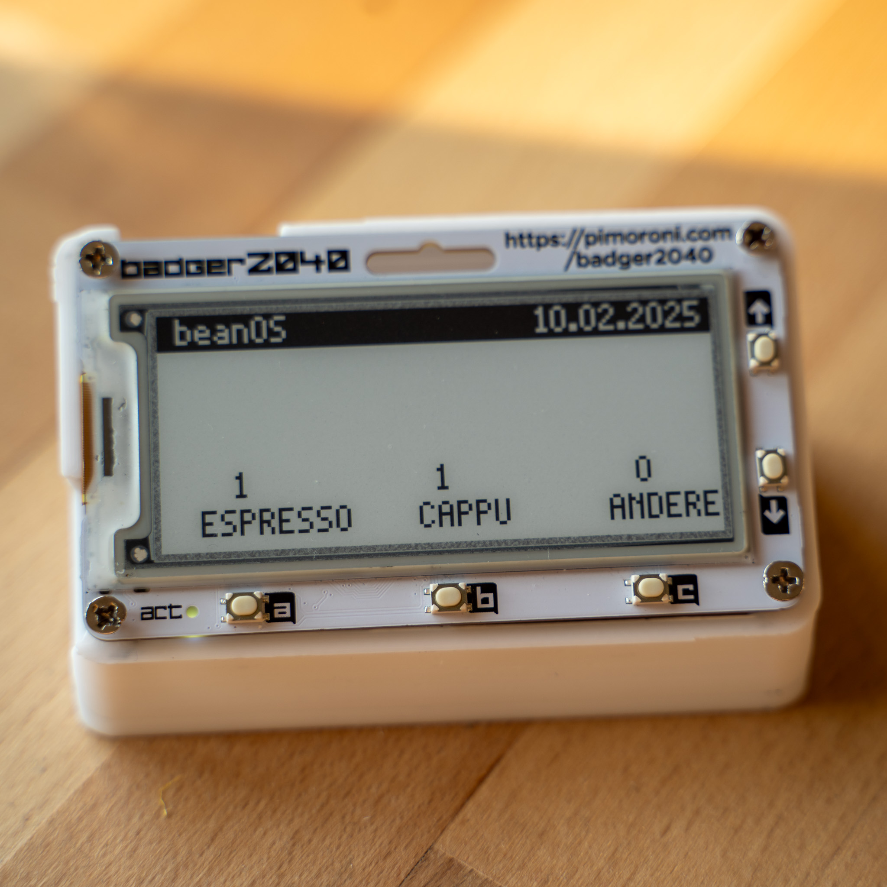
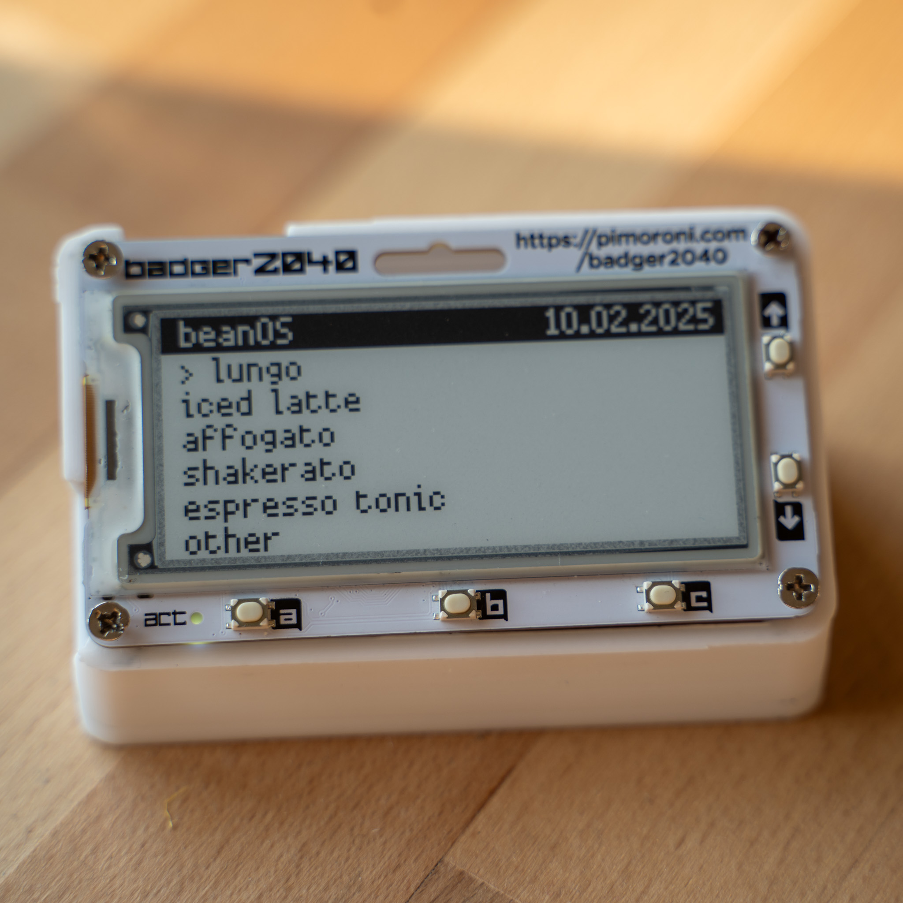
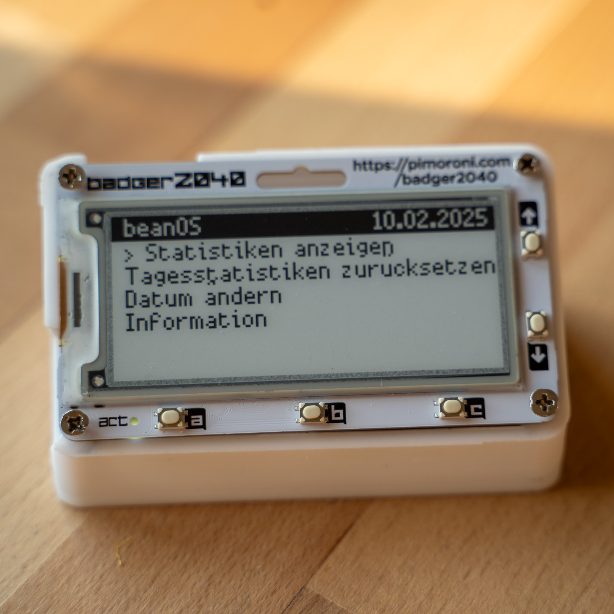

# beanOS

beanOS is a Micropython application designed for the Badger2040 device. It tracks and logs your coffee consumption, providing a simple interface to view statistics, reset counts, and change settings.

This code must not be used by fascists! No code for the AfD or Musk or Trump!

## Installation

To install beanOS on your Badger2040:
1. Connect your Badger2040 to your computer.
2. Open Thonny IDE.
3. Copy the `main.py` file content into Thonny's editor.
4. Save the file to your Badger2040 as `main.py`.

## Usage

### Main screen

#### Buttons
- **a:**
Increments the espresso count
- **b:**
Increments the cappuccino count
- **c:**
Opens the additional drink menu
- **UP:**
Opens the main menu
- **DOWN:**
Switches to the next day and resets the daily counts

### Drink menu

#### Buttons
- **a:**
Chooses the selected drink
- **c:**
Closes the menu
- **UP** & **DOWN:**
Navigate the menu

### Main menu

#### Buttons
- **a:**
Chooses the selected optoin
- **c:**
Closes the menu
- **UP** & **DOWN:**
Navigate the menu

#### Menu Options

- **View Statistics**: Displays total counts of espresso, cappuccino, and other drinks. Also shows bean consumption (grams per day, days per pack) and average coffee per day.
- **Reset Daily Counts**: Resets the daily counts for espresso, cappuccino, and other drinks.
- **Change Date**: Allows you to change the current date.
- **Information**: Displays version information and credits.
- **Bean Packs**: Lets you select the current pack size (e.g. 250g, 500g, 1000g) for more accurate bean consumption statistics.
- **Maintenance History**: (Placeholder) Overview of maintenance tasks.

### Bean Packs
You can select the current pack size in the menu. The statistics will show how many days a pack lasts and your average bean consumption per day.

### Maintenance Reminders
Automatic reminders for cleaning, descaling, and other maintenance tasks. Warnings are shown when tasks are due, based on your configuration.

## License

This project is licensed under the GNU GPLv3 License. See the LICENSE file for details.

## Author

Joao Neisinger
