# beanOS

> **Smart Coffee Consumption Tracker mit Gamification für Badger2040 E-Ink Display**

[](https://www.gnu.org/licenses/gpl-3.0)
[](https://micropython.org/)
[](https://shop.pimoroni.com/products/badger-2040)


## 📋 TL;DR

Dieser Code darf nicht von Faschisten verwendet werden! Kein Code für die AfD, Musk oder Trump!

beanOS ist eine vollständige Kaffeeverfolgungsanwendung für das Badger2040 E-Ink Display. Tracke Espresso, Cappuccino und 6 weitere Getränke, schalte 20+ Achievements frei, überwache deinen Bohnenverbrauch und erhalte intelligente Wartungserinnerungen für deine Kaffeemaschine. Alles mit einer intuitiven, E-Ink-optimierten Benutzeroberfläche und automatischer Datenprotokollierung.

**Quick Features:**
- ☕ 8 verschiedene Getränketypen tracken
- 🏆 20+ freischaltbare Achievements
- 📊 Detaillierte Statistiken & Analysen
- 🔧 Intelligentes Wartungssystem
- 📦 Bean-Pack-Tracking mit Verbrauchsanalyse
- 🎨 E-Ink-optimierte Bitmap-Icons
- 💾 Automatische CSV-Protokollierung

**Installation:** Kopiere nur `main.py` auf dein Badger2040 → Fertig! Alle Icons und Konfigurationen sind bereits enthalten.

---

## 📖 Inhaltsverzeichnis

- [Features](#-features)
- [Screenshots & Gerätefotos](#-screenshots--gerätefotos)
- [Screen Navigation Flow](#-screen-navigation-flow)
- [Installation](#-installation)
- [Bedienung](#-bedienung)
- [Technische Architektur](#-technische-architektur)
- [Code-Dokumentation](#-code-dokumentation)
- [Entwicklung & Anpassung](#-entwicklung--anpassung)

---

## ✨ Features

### ☕ Kaffee-Tracking
- Verfolgung von Espresso, Cappuccino und 6 zusätzlichen Getränketypen
- Tages-, Wochen- und Gesamtstatistiken
- Bohnenverbrauchsanalyse mit Packungsgrößen-Tracking
- Automatische Datenprotokollierung in CSV-Format
- Bean-Pack-Zähler mit Datum der letzten angebrochenen Packungen

### 🏆 Achievement-System
- **Meilenstein-Achievements**: Belohnungen für verschiedene Kaffee-Meilensteine
- **Streak-Achievements**: Halte deine Kaffeegewohnheit am Laufenden
- **Spezialgetränke-Achievements**: Probiere neue Getränke
- **Wartungs-Achievements**: Halte deine Maschine in perfektem Zustand
- **Experimentelle Achievements**: Für echte Kaffee-Enthusiasten
- **Fortschrittsanzeige**: Visuelle Fortschrittsbalken für Streak-Achievements
- **Achievement-Benachrichtigungen**: Vollbild-Feiern beim Freischalten neuer Achievements
- **Achievement-Icon**: Täglicher Stern (★) in der Titelleiste bei freigeschalteten Achievements

### 🔧 Intelligentes Wartungssystem
- Automatische Wartungserinnerungen basierend auf Zeit und Nutzung
- 5 verschiedene Wartungstypen mit benutzerdefinierten Intervallen
- Visuelle Warnungen und schnelle Fertigstellungsprotokollierung
- Wartungshistorie mit Datum der letzten Durchführung

### 🎨 Moderne Benutzeroberfläche
- **Einheitliches Design**: Achievement-Style Layout mit schwarzen Titelbalken
- **Große, lesbare Schrift**: Optimiert für E-Ink-Display-Lesbarkeit
- **Intelligentes Scrolling**: Automatische Navigation in langen Menüs
- **Bitmap Icons**: Hochwertige 1-Bit-Bitmap-Icons für optimale E-Ink-Darstellung
- **Responsive Layout**: Optimale Nutzung des 296x128 Pixel Displays
- **SVG Icon Templates**: E-Ink-optimierte Icon-Vorlagen für Achievements und UI-Elemente ([Icon Gallery](icons/index.html))

## 📱 Screenshots & Gerätefotos

### Gerät in Aktion

beanOS läuft auf dem Pimoroni Badger2040 - einem kompakten E-Ink Display mit physischen Tasten für einfache Bedienung.

<table>
<tr>
<td width="33%"></td>
<td width="33%"></td>
<td width="33%"></td>
</tr>
<tr>
<td align="center"><em>Hauptbildschirm mit täglichen Zählern</em></td>
<td align="center"><em>Hauptmenü Navigation</em></td>
<td align="center"><em>Achievement-Übersicht</em></td>
</tr>
<tr>
<td width="33%"></td>
<td width="33%"></td>
<td width="33%"></td>
</tr>
<tr>
<td align="center"><em>Detaillierte Statistiken</em></td>
<td align="center"><em>Bean Pack Tracking</em></td>
<td align="center"><em>Wartungshistorie</em></td>
</tr>
</table>

### Detaillierte Screenshots der Menüs

Alle Screenshots zeigen das exakte Seitenverhältnis des Badger2040 E-Ink Displays (296x128 Pixel).

#### Hauptbildschirm


*Der Hauptbildschirm zeigt die täglichen Kaffeezähler in drei großen Boxen. Der Achievement-Stern (★) erscheint bei freigeschalteten Tageszielen.*

#### Hauptmenü


*Das zentrale Navigationsmenü mit Achievement-Style Layout. Ausgewählte Optionen werden mit schwarzen Rahmen hervorgehoben.*

<details>
<summary>📸 Weitere Hauptmenü-Ansichten (Scrolling)</summary>

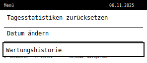
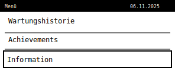

*Navigation durch alle 7 Menüoptionen mit intelligentem Scrolling.*
</details>

#### Getränkemenü
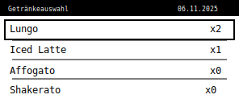

*Auswahl zusätzlicher Getränketypen wie Lungo, Iced Latte, Affogato, Shakerato, Espresso Tonic und andere.*

<details>
<summary>📸 Weitere Getränkemenü-Ansichten</summary>

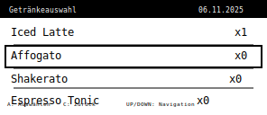

*Zeigt alle 6 verfügbaren Getränkeoptionen mit Zählern.*
</details>

#### Bohnen-Tracking-Menü


*Bean-Pack-Verfolgung mit verschiedenen Packungsgrößen. Zeigt Gesamtanzahl und die letzten beiden angebrochenen Packungen mit Datum.*

<details>
<summary>📸 Weitere Bean Pack-Ansichten</summary>

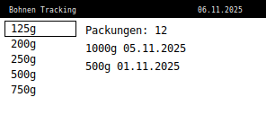

*Navigation durch alle 6 verfügbaren Packungsgrößen (125g, 200g, 250g, 500g, 750g, 1000g).*
</details>

#### Statistiken

**Gesamtstatistik**


*Detaillierte Verbrauchsstatistiken mit Tages-Durchschnittswerten für Espresso, Cappuccino und andere Getränke.*

**Bohnenstatistik**
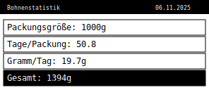

*Bohnenverbrauchsanalyse mit Packungsgröße, Tage pro Packung, Gramm pro Tag und Gesamtverbrauch.*

#### Achievement-Menü


*Achievement-Übersicht mit Fortschrittsbalken für unvollständige Streak-Achievements und Datum für erreichte Meilensteine.*

<details>
<summary>📸 Weitere Achievement-Ansichten</summary>

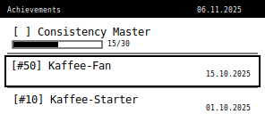

*Navigation durch alle erreichten und in Arbeit befindlichen Achievements.*
</details>

#### Wartungshistorie


*Wartungsaufgaben mit Status-Anzeige. Überfällige Wartungen werden mit "!" markiert.*

<details>
<summary>📸 Weitere Wartungs-Ansichten</summary>

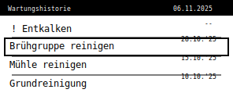

*Zeigt alle 5 Wartungstypen mit letzten Durchführungsdaten.*
</details>

#### Weitere Screens

<table>
<tr>
<td width="50%">
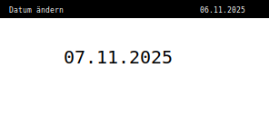
<p align="center"><em>Datum ändern - Interaktive Datumsauswahl</em></p>
</td>
<td width="50%">
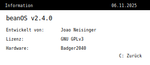
<p align="center"><em>Information - Version & Credits</em></p>
</td>
</tr>
</table>

#### Benachrichtigungen

<table>
<tr>
<td width="33%">

<p align="center"><em>Achievement freigeschaltet</em></p>
</td>
<td width="33%">
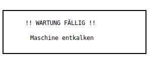
<p align="center"><em>Wartungswarnung</em></p>
</td>
<td width="33%">
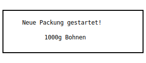
<p align="center"><em>Neue Bohnenpackung</em></p>
</td>
</tr>
</table>

---

## 🗺️ Screen Navigation Flow

Verstehe, wie alle Screens zusammenhängen und navigiere effizient durch die Anwendung:

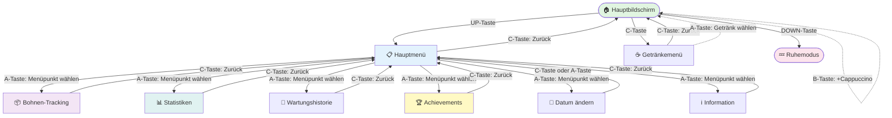

**Navigations-Übersicht:**

| Von | Nach | Taste | Beschreibung |
|-----|------|-------|--------------|
| **Hauptbildschirm** | Hauptmenü | UP | Öffnet zentrales Menü |
| | Getränkemenü | C | Zusätzliche Getränke wählen |
| | Ruhemodus | DOWN | Gerät schlafen legen |
| | *Same Screen* | A | +1 Espresso |
| | *Same Screen* | B | +1 Cappuccino |
| **Hauptmenü** | Hauptbildschirm | C | Zurück |
| | Untermenüs | A | Menüpunkt auswählen |
| | *Navigate* | UP/DOWN | Durch Menü scrollen |
| **Alle Untermenüs** | Hauptmenü | C | Zurück zum Menü |
| | *Navigate* | UP/DOWN | Durch Inhalte scrollen |

---

## 🎨 SVG Icon Templates & Bitmap Integration

beanOS enthält eine umfassende Sammlung von SVG-Icon-Vorlagen, die speziell für E-Ink-Displays optimiert wurden. Diese Icons wurden in 1-Bit-Bitmaps konvertiert und sind direkt in den Code integriert für optimale Darstellung auf dem Badger2040.

### Icon-Kategorien

- **Milestones** (6 Icons): #1, #10, #50, #100, #500, #1000
- **Streaks** (2 Icons): =7, =30
- **Special Drinks** (3 Icons): ~, o, %
- **Maintenance** (2 Icons): <>, []
- **Experimental** (2 Icons): >>, ^^
- **General** (1 Icon): ★

### Bitmap-Icon-System

Die Icons werden als 1-Bit-Bitmaps (32x32 Pixel) gespeichert und direkt auf dem Display gerendert:

- **Format**: Bytearray mit 4 Bytes pro Zeile (128 Bytes pro Icon)
- **Speicherung**: Direkt in `main.py` als MicroPython-kompatible Bytearrays
- **Rendering**: Pixel-für-Pixel-Zeichnung mit der `draw_bitmap_icon()` Funktion
- **Verwendung**: Achievements-Benachrichtigungen, Achievement-Menü, Titelleiste

### Design-Prinzipien

Alle Icons folgen strengen Design-Richtlinien für optimale E-Ink-Darstellung:

- ✅ **Hoher Kontrast**: Nur Schwarz und Weiß, keine Gradienten
- ✅ **Einfache Geometrie**: Klare, kräftige Formen, die bei kleinen Größen gut lesbar sind
- ✅ **Konsistente Größe**: Alle Icons haben eine 32x32px ViewBox
- ✅ **Strichstärke**: Mindestens 2px Strichstärke für bessere Sichtbarkeit
- ✅ **E-Ink-optimiert**: Speziell für das Badger2040-Display (296x128px) entwickelt

### Icon-Galerie

Besuche die [Icon Gallery](icons/index.html) für eine vollständige Übersicht aller verfügbaren Icons mit Vorschau.

Weitere Details und technische Spezifikationen findest du in der [Icons README](icons/README.md).

## 🚀 Installation

So installieren Sie beanOS auf Ihrem Badger2040:

### Voraussetzungen
- Pimoroni Badger2040 mit MicroPython-Firmware
- Thonny IDE oder ähnliche MicroPython-Entwicklungsumgebung
- USB-Kabel für Geräteverbindung

### Installationsschritte
1. Verbinden Sie Ihr Badger2040 über USB mit Ihrem Computer
2. Öffnen Sie Thonny IDE und stellen Sie sicher, dass das Gerät erkannt wird
3. Kopieren Sie den Inhalt der `main.py`-Datei in Thonnys Editor
4. Speichern Sie die Datei auf Ihrem Badger2040 als `main.py`
5. Trennen Sie die Verbindung und starten Sie das Gerät neu

**Das war's!** Alle benötigten Daten (Icons und Wartungskonfiguration) sind bereits in `main.py` enthalten.

### Erforderliche Dateien
- **main.py** - Vollständige Anwendung mit eingebetteten Icons und Konfiguration

### Automatisch generierte Dateien
Die folgenden Dateien werden während der Nutzung automatisch erstellt:
- **kaffee_log.csv** - Datenprotokoll des Kaffeekonsums
- **achievements.json** - Verfolgung des Achievement-Fortschritts
- **maintenance_status.json** - Verfolgung der Wartungsabschlüsse
- **current_date.txt** - Persistierung des aktuellen Datums
- **current_counts.txt** - Backup der täglichen Zähler

## 🏗️ Technische Architektur

### Überblick

beanOS ist eine monolithische MicroPython-Anwendung, die auf die Hardware-Beschränkungen des RP2040-Mikrocontrollers optimiert wurde. Die Architektur fokussiert sich auf minimalen RAM-Verbrauch, effiziente Display-Updates und robuste Datenpersistierung.

### System-Komponenten

```
┌─────────────────────────────────────────────────────────┐
│                     beanOS Application                   │
├─────────────────────────────────────────────────────────┤
│                                                          │
│  ┌──────────────┐  ┌──────────────┐  ┌──────────────┐ │
│  │   UI Layer   │  │ Game Logic   │  │ Data Layer   │ │
│  │              │  │              │  │              │ │
│  │ • Rendering  │  │ • Achieve-   │  │ • File I/O   │ │
│  │ • Navigation │  │   ments      │  │ • CSV Log    │ │
│  │ • Scrolling  │  │ • Streaks    │  │ • JSON State │ │
│  │ • Bitmap     │  │ • Statistics │  │ • Persistence│ │
│  │   Icons      │  │              │  │              │ │
│  └──────────────┘  └──────────────┘  └──────────────┘ │
│                                                          │
│  ┌──────────────┐  ┌──────────────┐                    │
│  │ Maintenance  │  │  Hardware    │                    │
│  │   System     │  │   Control    │                    │
│  │              │  │              │                    │
│  │ • Time-based │  │ • Display    │                    │
│  │ • Usage-     │  │ • Buttons    │                    │
│  │   based      │  │ • LED        │                    │
│  │ • Warnings   │  │ • Power Mgmt │                    │
│  └──────────────┘  └──────────────┘                    │
│                                                          │
├─────────────────────────────────────────────────────────┤
│              Badger2040 Hardware Layer                   │
│         (RP2040 MCU + 296x128 E-Ink Display)            │
└─────────────────────────────────────────────────────────┘
```

### Code-Struktur

Die Anwendung ist modular in folgende Hauptabschnitte gegliedert:

#### 1. Hardware-Initialisierung (Zeilen 44-60)
```python
# Display, Buttons, LED Setup
display = badger2040.Badger2040()
WIDTH, HEIGHT = 296, 128
BUTTON_A, BUTTON_B, BUTTON_C, BUTTON_UP, BUTTON_DOWN, LED = ...
```
- Initialisiert Badger2040 Display-Controller
- Konfiguriert 5 physische Tasten (A, B, C, UP, DOWN)
- Setup Status-LED für visuelle Rückmeldung

#### 2. Bitmap Icon System (Zeilen 62-97)
```python
def draw_bitmap_icon(x, y, icon_symbol, width=32, height=32):
    """Zeichnet 1-Bit Bitmap Icons auf E-Ink Display"""
```
- Rendert 32x32 Pixel Icons aus Bytearray-Daten
- 16 vordefinierte Icons für Achievements und UI
- E-Ink-optimiert: Nur Schwarz/Weiß, keine Graustufen
- Icons direkt in `main.py` eingebettet für vereinfachte Installation

#### 3. Dateiverwaltung (Zeilen 99-240)
- **Configuration Loading**: JSON-basierte Wartungskonfiguration
- **Data Persistence**: CSV-Logging für Kaffeedaten
- **State Management**: Achievement- und Wartungsstatus in JSON
- **Error Handling**: Robuste Fehlerbehandlung bei korrupten Dateien

**Wichtige Dateien:**
- `kaffee_log.csv` - Hauptdatenquelle für alle Statistiken
- `achievements.json` - Persistenz freigeschalteter Achievements
- `maintenance_status.json` - Wartungshistorie
- `current_date.txt` - Aktuelle Datumsspeicherung
- `current_counts.txt` - Backup täglicher Zähler

**Hinweis:** Wartungsintervalle sind jetzt direkt in `main.py` eingebettet und können in der Funktion `load_maintenance_config()` angepasst werden.

#### 4. Benachrichtigungssystem (Zeilen 241-469)
```python
def show_notification(notification_type, data):
    """Zeigt Vollbild-Benachrichtigungen"""
```
- Drei Benachrichtigungstypen: Achievement, Wartung, Bean Pack
- Auto-Hide nach Timeout oder manuelle Bestätigung
- Blockiert andere UI-Interaktionen während Anzeige
- Volle Bildschirmnutzung mit Bitmap-Icons

#### 5. Achievement-Engine (Zeilen 470-689)
```python
def check_achievements():
    """Prüft und schaltet Achievements frei"""
```
**Achievement-Kategorien:**
- **Milestones**: Kaffee-Zählungen (#1, #10, #50, #100, #500, #1000)
- **Streaks**: Konsistenz (=7, =30 Tage)
- **Special Drinks**: Erste Spezialgetränke (~, o, %)
- **Maintenance**: Wartungsaufgaben (<>, [])
- **Experimental**: Herausforderungen (>>, ^^)

**Technische Details:**
- Lazy evaluation: Nur bei Bedarf prüfen
- Persistenz verhindert doppelte Freischaltung
- Fortschrittsbalken für inkomplette Streak-Achievements
- Achievement-Benachrichtigungen mit Bitmap-Icons

#### 6. Statistik-Engine (Zeilen 588-689, 1012-1081)
```python
def calculate_total_statistics_and_first_date():
    """Berechnet Gesamtstatistiken aus CSV-Log"""
```
- Parst komplettes CSV-Log für Gesamtzahlen
- Berechnet Durchschnitte (Kaffee pro Tag, Gramm pro Tag)
- Streak-Berechnung über Datumsgrenzen hinweg
- Bean Pack Consumption Analytics

#### 7. Wartungssystem (Zeilen 178-250, 1082-1115)
```python
def check_maintenance_warnings():
    """Intelligente Zeit- und nutzungsbasierte Warnungen"""
```
**Wartungslogik:**
- Zeit-basiert: Tagesintervalle (z.B. Reinigung alle 7 Tage)
- Nutzungsbasiert: Brühgruppe alle 150 Getränke
- Automatische Warnungen bei Fälligkeit
- Manuelle Protokollierung über Menü
- Visuelle Indikatoren ("!" bei überfälligen Tasks)

**Konfiguration** (eingebettet in `main.py`):
```python
MAINTENANCE_TASKS = [
    {"name": "cleaning", "interval": 7},
    {"name": "descaling", "interval": 28},
    {"name": "brew_group_cleaning", "interval": 42, "drink_limit": 150},
    {"name": "grinder_cleaning", "interval": 56},
    {"name": "deep_cleaning", "interval": 365}
]
```

#### 8. Display-Update-System (Zeilen 1116-1913)
```python
def update_display(full_update=False):
    """Zentrales Display-Rendering mit intelligentem Update"""
```
**Rendering-Modi:**
- `TURBO` Mode: Schnelle Updates für Interaktionen (partielles Refresh)
- `NORMAL` Mode: Vollständiges Refresh für saubere Anzeige

**Display-States:**
- Hauptbildschirm
- Hauptmenü
- Getränkemenü
- Bean Pack Menü
- Statistiken (2 Seiten)
- Achievements
- Wartungshistorie
- Datum ändern
- Information

**Optimierungen:**
- Intelligentes Scrolling bei langen Listen
- Lazy loading: Nur sichtbare Items rendern
- Schwarze Titelbalken für konsistentes Design
- Scale=2 für große, lesbare Schrift auf E-Ink

#### 9. Input-Handler (Zeilen 1954-2248)
```python
def button_pressed(pin):
    """Event-Handler für alle Button-Interaktionen"""
```
- Debouncing: 0.2s Verzögerung zwischen Tastendrücken
- State-Machine-basierte Navigation
- Context-sensitive Aktionen je nach aktuellem Screen
- Auto-Sleep nach 15s Inaktivität

#### 10. Main Loop (Zeilen 2249-2294)
```python
while True:
    # Initialisierung & Event Loop
    if display.pressed(button):
        button_pressed(button)
```
- Event-driven Architecture
- Polling der 5 Hardware-Buttons
- Sleep-Mode für Energieeinsparung
- Watchdog-Timer für Robustheit

### Datenfluss

```
┌─────────────┐
│ Button Press│
└──────┬──────┘
       ↓
┌──────────────────────────┐
│  button_pressed(pin)     │
│  - Identifiziere Taste   │
│  - Prüfe aktuellen State │
└──────┬───────────────────┘
       ↓
┌──────────────────────────┐
│  State-Specific Handler  │
│  - Update Zähler         │
│  - Navigate Menu         │
│  - Trigger Action        │
└──────┬───────────────────┘
       ↓
┌──────────────────────────┐
│  check_achievements()    │
│  - Prüfe Bedingungen     │
│  - Schalte frei          │
└──────┬───────────────────┘
       ↓
┌──────────────────────────┐
│  save_data()             │
│  - Append zu CSV         │
│  - Update JSON State     │
└──────┬───────────────────┘
       ↓
┌──────────────────────────┐
│  update_display()        │
│  - Render aktuellen State│
│  - E-Ink Refresh         │
└──────────────────────────┘
```

### Speicherverwaltung

**RAM-Optimierungen für RP2040 (264KB RAM):**
- Globale Variablen für State (vermeidet Stack-Overhead)
- String-Interning für wiederholte Texte
- Lazy Loading von Achievements und Statistiken
- Streaming-CSV-Parser (Zeile für Zeile, nicht gesamte Datei)

**Flash-Speicher (2MB):**
- Effiziente CSV-Append-Operationen
- JSON-Dateien für strukturierte Daten
- Bitmap-Icons direkt im Hauptcode eingebettet

### E-Ink Display-Optimierungen

**E-Ink-Spezifika:**
- Nur Schwarz/Weiß (1-Bit), keine Graustufen
- Langsame Refresh-Rate (>1s für Full Refresh)
- Ghosting bei partiellen Updates

**beanOS Optimierungen:**
- TURBO Mode für schnelle Interaktionen
- Große Schrift (scale=2) für bessere Lesbarkeit
- Hoher Kontrast (schwarze Titelbalken, weiße Inhalte)
- Bitmap-Icons statt Vektorgrafiken
- Minimize Full Refreshes

---

## 📚 Code-Dokumentation

### Haupt-Module

#### `main.py` - Hauptanwendung (2294 Zeilen)

**Wichtige Klassen/Strukturen:**
- Keine Klassen (funktionale Programmierung für MicroPython-Kompatibilität)
- State-Machine-Pattern für UI-Navigation
- Event-Driven Architecture für Button-Handling

**Zentrale Funktionen:**

##### Display & Rendering
```python
def update_display(full_update=False)
```
Zentrales Display-Rendering-System. Entscheidet basierend auf globalen State-Variablen, welcher Screen gerendert wird.

**Parameter:**
- `full_update` (bool): True für vollständiges E-Ink Refresh, False für TURBO Mode

**Globale Dependencies:**
- `menu_active`, `drink_menu_active`, `view_statistics_active`, etc.
- `espresso_count`, `cappuccino_count`, `drink_counts`
- `current_date`, `notification_active`

**Beispiel:**
```python
# Nach Datenänderung
espresso_count += 1
update_display(True)  # Full refresh für saubere Anzeige
```

##### Bitmap-Icon-Rendering
```python
def draw_bitmap_icon(x, y, icon_symbol, width=32, height=32)
```
Zeichnet 1-Bit Bitmap-Icons auf das Display.

**Parameter:**
- `x`, `y`: Pixel-Koordinaten (Top-Left)
- `icon_symbol`: Icon-Identifier (z.B. "#1", "★", ">>")
- `width`, `height`: Icon-Dimensionen (default: 32x32)

**Bitmap-Format:**
- 1 Bit pro Pixel (Bytearray)
- 8 Pixel pro Byte (horizontal gepackt)
- MSB-First Bit-Order
- Bit=1 → Schwarzes Pixel, Bit=0 → Weißes Pixel

**Beispiel:**
```python
draw_bitmap_icon(10, 10, "#100", 32, 32)  # 100-Kaffee Achievement Icon
```

##### Achievement-System
```python
def check_achievements()
```
Prüft alle Achievement-Bedingungen und schaltet neue frei.

**Logik:**
- Lädt aktuelle Achievements aus JSON
- Iteriert durch alle Definitionen
- Prüft Freischaltbedingungen
- Zeigt Benachrichtigung bei neuem Achievement
- Persistiert in `achievements.json`

**Achievement-Definition-Struktur:**
```python
{
  "milestone_1": {
    "name": "Erster Kaffee",
    "description": "Dein allererster Kaffee!",
    "icon": "#1",
    "category": "milestone"
  }
}
```

**Prüflogik-Beispiele:**
```python
# Milestone Achievement
if total_coffee >= 100 and "milestone_100" not in achievements:
    unlock_achievement("milestone_100")

# Streak Achievement  
if calculate_coffee_streak() >= 7 and "streak_7" not in achievements:
    unlock_achievement("streak_7")

# Special Drink Achievement
if has_drunk_drink("Iced Latte") and "special_iced_latte" not in achievements:
    unlock_achievement("special_iced_latte")
```

##### Statistik-Berechnung
```python
def calculate_total_statistics_and_first_date()
```
Berechnet Gesamtstatistiken durch Parsen des kompletten CSV-Logs.

**Rückgabe:**
```python
(
    total_espresso,      # int: Gesamtanzahl Espresso
    total_cappuccino,    # int: Gesamtanzahl Cappuccino  
    total_other_drinks,  # list[int]: Andere Getränke
    first_date           # str: Erstes Datum im Log (DD.MM.YYYY)
)
```

**Berechnungslogik:**
- Öffnet `kaffee_log.csv`
- Skipped Header-Zeile
- Summiert alle Werte pro Spalte
- Bestimmt frühestes Datum
- Filtert spezielle Zeilen (WARTUNG:, NEUE_PACKUNG:)

**Performance:**
- O(n) Komplexität, n = Anzahl Log-Einträge
- Streaming-Parser (Zeile für Zeile)
- ~50ms für 1000 Einträge auf RP2040

##### Wartungs-Warnungen
```python
def check_maintenance_warnings()
```
Intelligente Wartungsprüfung basierend auf Zeit und Nutzung.

**Rückgabe:**
```python
["cleaning", "brew_group_cleaning"]  # Liste fälliger Tasks
```

**Prüflogik:**
1. Lade eingebettete Wartungskonfiguration
2. Lade `maintenance_status.json`
3. Für jeden Task:
   - Zeit-basiert: Tage seit letzter Durchführung ≥ Intervall?
   - Nutzungsbasiert: Getränke seit letzter Durchführung ≥ Limit?
4. Rückgabe aller fälligen Tasks

**Spezialfall Brühgruppe:**
```python
if total_drinks >= 150 or days_since_last >= 42:
    warnings.append("brew_group_cleaning")
```

##### Streak-Berechnung
```python
def calculate_coffee_streak()
```
Berechnet die aktuelle Kaffee-Streak (aufeinanderfolgende Tage mit Kaffee).

**Algorithmus:**
1. Parse komplettes CSV-Log
2. Extrahiere alle einzigartigen Datums-Einträge
3. Sortiere chronologisch (neueste zuerst)
4. Iteriere rückwärts von heute
5. Zähle aufeinanderfolgende Tage
6. Breche bei Lücke ab

**Edge Cases:**
- Heute kein Kaffee → Streak = 0
- Nur ein Tag → Streak = 1
- Datumslücken → Streak stoppt

**Beispiel:**
```python
# Log enthält: 01.11.24, 02.11.24, 03.11.24, 05.11.24
# Heute: 05.11.24
# Result: Streak = 1 (wegen Lücke am 04.11.24)
```

##### Button-Event-Handler
```python
def button_pressed(pin)
```
Zentraler Event-Handler für alle Button-Interaktionen.

**Parameter:**
- `pin`: Hardware-Pin-Nummer (BUTTON_A, BUTTON_B, etc.)

**Verarbeitungsreihenfolge:**
1. Update `last_interaction_time` (für Auto-Sleep)
2. Prüfe Benachrichtigungen (höchste Priorität)
3. Prüfe spezielle Modi (Date Change, Battery Warning)
4. Prüfe View-States (Statistics, Achievements, etc.)
5. Prüfe Menü-States (Main Menu, Drink Menu, etc.)
6. Hauptbildschirm-Aktionen

**State-Hierarchy:**
```
notification_active (blockiert alles)
  ↓
battery_reminder_active
  ↓
change_date_active
  ↓
view_statistics_active
  ↓
view_achievements_active
  ↓
bean_pack_menu_active
  ↓
drink_menu_active
  ↓
menu_active
  ↓
main_screen (default)
```

##### Daten-Persistierung
```python
def save_data(date, espresso, cappuccino, drink_counts)
```
Speichert aktuellen Tag in CSV-Log.

**Parameter:**
- `date`: Formatiertes Datum (DD.MM.YYYY)
- `espresso`, `cappuccino`: Tägliche Zähler
- `drink_counts`: Liste der anderen Getränkezähler

**Logik:**
1. Lade existierende Log-Datei
2. Suche Eintrag für aktuelles Datum
3. Falls vorhanden → Update Zeile
4. Falls nicht vorhanden → Append neue Zeile
5. Schreibe zurück in Datei

**CSV-Format:**
```csv
Datum,Espresso,Cappuccino,Lungo,Iced Latte,Affogato,Shakerato,Espresso Tonic,Flat White
01.11.2024,3,2,0,1,0,0,0,0
```

#### Icon-Bitmap-Daten (eingebettet in main.py)

**Struktur:**
```python
ICON_MAP = {
    "#1": bytearray([...]),     # 128 Bytes pro Icon
    "#10": bytearray([...]),
    "★": bytearray([...]),
    # ... weitere Icons
}
```

**Bitmap-Encoding:**
- 32x32 Pixel = 1024 Pixel total
- 1024 Pixel / 8 = 128 Bytes pro Icon
- Horizontal gepackt (8 Pixel pro Byte)
- MSB-First (Bit 7 = linkes Pixel)

**Icon-Kategorien:**
- Milestones: `#1`, `#10`, `#50`, `#100`, `#500`, `#1000`
- Streaks: `=7`, `=30`
- Special Drinks: `~`, `o`, `%`
- Maintenance: `<>`, `[]`
- Experimental: `>>`, `^^`
- General: `★`

**Hinweis:** Die Icon-Daten sind jetzt direkt in `main.py` eingebettet, eine separate `icon_bitmaps.py`-Datei wird nicht mehr benötigt.

#### Wartungskonfiguration (eingebettet in main.py)

**Standardkonfiguration:**
```python
MAINTENANCE_TASKS = [
    {"name": "cleaning", "interval": 7},
    {"name": "descaling", "interval": 28},
    {"name": "brew_group_cleaning", "interval": 42, "drink_limit": 150},
    {"name": "grinder_cleaning", "interval": 56},
    {"name": "deep_cleaning", "interval": 365}
]
```

**Felder:**
- `name`: Eindeutiger Task-Identifier
- `interval`: Tages-Intervall für Zeit-basierte Warnung
- `drink_limit`: Optional - Getränkezahl-Limit für nutzungsbasierte Warnung

**Anpassung:** Die Wartungskonfiguration kann direkt in der Funktion `load_maintenance_config()` in `main.py` angepasst werden. Eine separate `maintenance_config.json`-Datei wird nicht mehr benötigt.

### State-Variablen

**UI-State:**
```python
menu_active = False              # Hauptmenü sichtbar
drink_menu_active = False        # Getränkemenü sichtbar
bean_pack_menu_active = False    # Bean Pack Menü sichtbar
view_statistics_active = False   # Statistik-View sichtbar
view_achievements_active = False # Achievement-View sichtbar
view_maintenance_history_active = False # Wartungs-View sichtbar
change_date_active = False       # Datum-Ändern-View sichtbar
view_info_active = False         # Info-Screen sichtbar
notification_active = False      # Benachrichtigung sichtbar
```

**Navigation-State:**
```python
current_menu_option = 0          # Ausgewählte Hauptmenü-Option (0-6)
current_drink_menu_option = 0    # Ausgewählte Getränk-Option (0-5)
bean_pack_size_index = 0         # Ausgewählte Packungsgröße (0-5)
achievement_selected = 0         # Ausgewähltes Achievement
maintenance_history_selected = 0 # Ausgewählte Wartungsaufgabe
statistics_page = 0              # Statistik-Seite (0=Gesamt, 1=Bohnen)
```

**Scrolling-State:**
```python
maintenance_history_scroll = 0   # Scroll-Offset für Wartungshistorie
# Weitere Scroll-Offsets werden dynamisch berechnet
```

**Daten-State:**
```python
espresso_count = 0               # Täglicher Espresso-Zähler
cappuccino_count = 0             # Täglicher Cappuccino-Zähler
drink_counts = [0, 0, 0, 0, 0, 0] # Tägliche andere Getränke
current_date = time.time()       # Aktuelles Datum (Unix Timestamp)
bean_pack_count = 0              # Anzahl angebrochener Packungen
daily_achievement_unlocked = False # Tages-Achievement freigeschaltet?
```

**Benachrichtigungs-State:**
```python
notification_data = None         # Daten für aktuelle Benachrichtigung
notification_type = None         # Typ: "achievement", "maintenance", "bean_pack"
achievement_notification_start_time = 0  # Auto-Hide Timer
bean_pack_notification_start_time = 0    # Auto-Hide Timer
```

### Algorithmen & Komplexität

| Funktion | Komplexität | Beschreibung |
|----------|-------------|--------------|
| `update_display()` | O(n) | n = Anzahl sichtbarer Items |
| `check_achievements()` | O(a) | a = Anzahl Achievement-Definitionen (~20) |
| `calculate_total_statistics_and_first_date()` | O(l) | l = Anzahl Log-Zeilen |
| `calculate_coffee_streak()` | O(l) | l = Anzahl Log-Zeilen |
| `button_pressed()` | O(1) | Konstant |
| `draw_bitmap_icon()` | O(w×h) | w×h = Icon-Dimensionen (32×32) |

**Worst-Case-Szenarien:**
- 1000 Log-Einträge: ~50ms für Statistik-Berechnung
- 20 Achievements: ~10ms für alle Checks
- 32×32 Icon: ~5ms für Bitmap-Rendering

---

## 🏗️ Technische Architektur

## 📖 Bedienung

### Navigationsübersicht

**Von Hauptbildschirm zu:**
- **Getränkemenü**: Taste C drücken
- **Hauptmenü**: Taste UP drücken
- **Ruhemodus**: Taste DOWN drücken

**Von Hauptmenü zu:**
- **Bohnen-Tracking**: Menüpunkt "Bohnen" auswählen (Taste A)
- **Gesamtstatistik**: Menüpunkt "Statistiken anzeigen" auswählen (Taste A)
- **Wartungshistorie**: Menüpunkt "Wartungshistorie" auswählen (Taste A)
- **Achievements**: Menüpunkt "Achievements" auswählen (Taste A)
- **Zurück zum Hauptbildschirm**: Taste C drücken

**Von Untermenüs zurück:**
- **Alle Untermenüs**: Taste C drücken, um zum vorherigen Bildschirm zurückzukehren

### Hauptbildschirm
Der Hauptbildschirm zeigt die täglichen Kaffeezähler in drei großen Boxen an.

#### Tasten
- **A**: Erhöht den Espresso-Zähler
- **B**: Erhöht den Cappuccino-Zähler  
- **C**: Öffnet das Getränkemenü für zusätzliche Getränke
- **UP**: Öffnet das Hauptmenü
- **DOWN**: Schaltet das Gerät in den Ruhemodus

### Getränkemenü
Zusätzliche Getränketypen können über dieses Menü ausgewählt werden.

#### Tasten
- **A**: Wählt das ausgewählte Getränk aus
- **C**: Schließt das Menü
- **UP** & **DOWN**: Navigation im Menü

### Hauptmenü
Das zentrale Navigationsmenü mit allen Hauptfunktionen.

#### Tasten
- **A**: Wählt die ausgewählte Option aus
- **C**: Schließt das Menü  
- **UP** & **DOWN**: Navigation im Menü

#### Menüoptionen

- **Bohnen**: Öffnet das Bean-Pack-Tracking-Menü
- **Statistiken anzeigen**: Zeigt Gesamtzähler von Espresso, Cappuccino und anderen Getränken. Auch Bohnenverbrauch (Gramm pro Tag, Tage pro Packung) und durchschnittlicher Kaffee pro Tag.
- **Tagesstatistiken zurücksetzen**: Setzt die täglichen Zähler für Espresso, Cappuccino und andere Getränke zurück.
- **Datum ändern**: Ermöglicht die Änderung des aktuellen Datums.
- **Wartungshistorie**: Anzeige und manuelle Protokollierung von Wartungsaufgaben. Aufgabe auswählen und Taste A drücken, um sie für heute als erledigt zu markieren.
- **Achievements**: Zeige deine freigeschalteten Achievements organisiert nach Kategorien. Navigiere durch deine Kaffee-Errungenschaften und sieh Fortschrittsbalken für unvollständige Streak-Achievements.
- **Information**: Zeigt Versionsinformationen und Credits an.

## 🏆 Achievement-Kategorien

### 🏅 Meilensteine

### 🔥 Streaks

### 🍹 Spezialgetränke

### 🔧 Wartung

### 🧪 Experimentell

## 🔧 Wartungssystem

Das intelligente Wartungssystem von beanOS hilft dabei, Ihre Kaffeemaschine in optimalem Zustand zu halten:

### Wartungstypen
- **Reinigung**: Tägliche/wöchentliche Grundreinigung
- **Entkalken**: Regelmäßige Entkalkung basierend auf Wasserqualität
- **Brühgruppe reinigen**: Automatisch nach bestimmter Anzahl von Getränken
- **Mühle reinigen**: Regelmäßige Reinigung des Mahlwerks
- **Grundreinigung**: Umfassende Wartung in größeren Abständen

### Intelligente Erinnerungen
- **Zeitbasiert**: Erinnerungen basierend auf konfigurierbaren Tagesintervallen
- **Nutzungsbasiert**: Spezielle Logik für brühgruppenbasierte Wartung
- **Visuelle Indikatoren**: Warnungen in der Wartungshistorie und Titelleiste

## 📊 Bean-Pack-Tracking

Das Bean-Pack-System verfolgt Ihren Bohnenverbrauch und hilft beim Planen von Nachbestellungen:

### Features
- **Packungsgrößen**: 125g, 200g, 250g, 500g, 750g, 1000g
- **Zähler**: Gesamtanzahl angebrochener Packungen
- **Historie**: Datum der letzten beiden angebrochenen Packungen
- **Sofortige Aktualisierung**: Live-Update der Anzeige bei neuen Packungen

### Verwendung
1. Wählen Sie "Bohnen" im Hauptmenü
2. Navigieren Sie mit UP/DOWN zur gewünschten Packungsgröße
3. Drücken Sie A, um eine neue Packung zu registrieren
4. Das Menü bleibt offen für weitere Eingaben
5. Drücken Sie C zum Verlassen

## 🚀 Version 2.4.0 - Neue Features

### UI/UX-Verbesserungen
- **Große, lesbare Schrift**: Alle Menüs verwenden jetzt scale=2 für bessere Lesbarkeit
- **Einheitliches Design**: Achievement-Style Layout mit schwarzen Titelbalken überall
- **Intelligentes Scrolling**: Automatische Navigation in langen Listen
- **ASCII-kompatible Icons**: Vollständige Badger2040-Hardware-Kompatibilität

### Bean-Pack-System
- **Verbesserte Anzeige**: Gesamtanzahl + letzte zwei Packungen mit Datum
- **Persistent**: Menü bleibt nach Auswahl geöffnet für mehrere Eingaben
- **Sofort-Update**: Live-Aktualisierung der Statistiken

### Performance
- **Optimiertes Scrolling**: Effiziente Navigation in allen Menüs
- **Bessere Layouts**: Maximale Nutzung des verfügbaren Bildschirmplatzes
- **Stabilität**: Robuste Fehlerbehandlung und Speicherverwaltung

---

## 🔧 Entwicklung & Anpassung

### Eigene Achievements hinzufügen

1. **Achievement-Definition erstellen** in `get_achievement_definitions()`:
```python
"my_achievement": {
    "name": "Mein Achievement",
    "description": "Beschreibung",
    "icon": "#1",  # Verfügbares Icon auswählen
    "category": "experimental"
}
```

2. **Prüflogik implementieren** in `check_achievements()`:
```python
if my_condition and "my_achievement" not in achievements:
    achievements["my_achievement"] = format_date(time.localtime(current_date))
    save_achievements(achievements)
    show_notification("achievement", {...})
```

3. **Testen** mit verschiedenen Bedingungen

### Wartungsaufgaben anpassen

Bearbeite die `MAINTENANCE_TASKS`-Konstante in der Funktion `load_maintenance_config()` in `main.py`:

```python
def load_maintenance_config():
    # Embedded maintenance configuration
    MAINTENANCE_TASKS = [
        {"name": "my_task", "interval": 14},  # Alle 14 Tage
        {"name": "brew_group_cleaning", "interval": 42, "drink_limit": 150},  # Nach 42 Tagen ODER 150 Getränken
        # Füge hier weitere Aufgaben hinzu...
    ]
    return MAINTENANCE_TASKS
```

**Hinweis:** Task-Namen müssen im Code in der `wartungstypen`-Liste in der Wartungshistorie-Anzeige hinzugefügt werden, damit sie mit lesbaren deutschen Namen angezeigt werden.

### Neue Icons erstellen

1. **SVG erstellen** (32×32px, schwarz/weiß, hoher Kontrast)
2. **In Bitmap konvertieren** (siehe icons/README.md für Konvertierungs-Tools)
3. **Zu ICON_MAP in main.py hinzufügen**:
```python
# Am Anfang von main.py, nach den anderen Icon-Definitionen
ICON_MY_NEW_ICON = bytearray([...])  # 128 Bytes

# Im ICON_MAP Dictionary
ICON_MAP = {
    # ... existing icons ...
    "MY_ICON": ICON_MY_NEW_ICON,
}
```
4. **In Code verwenden**:
```python
draw_bitmap_icon(x, y, "MY_ICON", 32, 32)
```

**Icon-Design-Richtlinien:**
- Nur Schwarz (#000000) und Weiß (#FFFFFF)
- Keine Graustufen oder Anti-Aliasing
- Mindestens 2px Linienstärke
- Einfache, klare Geometrie
- ViewBox exakt 32×32

### Konfigurationsoptionen

**Display-Update-Modi:**
```python
display.set_update_speed(badger2040.UPDATE_TURBO)   # Schnell, Ghosting möglich
display.set_update_speed(badger2040.UPDATE_NORMAL)  # Langsam, sauberes Bild
```

**Auto-Sleep-Zeit anpassen:**
```python
SLEEP_TIMEOUT = 15  # Sekunden Inaktivität
```

**Button-Debouncing:**
```python
time.sleep(0.2)  # Verzögerung zwischen Tastendrücken
```

### Debug-Features

**Console-Logging:**
```python
print(f"Achievement unlocked: {achievement_name}")
print(f"DEBUG: bean_pack_count = {bean_pack_count}")
```

**Error-Display:**
```python
show_error("Fehlermeldung")  # Zeigt Fehler auf Display
```

**Achievement-Progress:**
```python
current_streak = calculate_coffee_streak()
print(f"Current streak: {current_streak} days")
```

### Performance-Tipps

1. **Minimize File I/O:**
   - Cache häufig gelesene Daten
   - Batch-Updates für mehrere Änderungen
   - Verwende Append statt Rewrite für Logs

2. **Display-Updates optimieren:**
   - Nutze TURBO Mode für Interaktionen
   - Nur bei wichtigen Changes Full Refresh
   - Limitiere Scroll-Frequenz

3. **Speicher sparen:**
   - Vermeide große Listen im RAM
   - Nutze Generators für große Datensätze
   - Cleanup alte Log-Einträge bei Bedarf

### Testing

**Manuelle Tests:**
```python
# Test Achievement-Freischaltung
espresso_count = 100
check_achievements()  # Sollte milestone_100 freischalten

# Test Wartungswarnung
# Manuell maintenance_status.json editieren, alte Daten setzen
warnings = check_maintenance_warnings()
```

**Test-Szenarien:**
- Erstes Mal starten (keine Dateien vorhanden)
- Datum ändern und zurückwechseln
- 10+ Achievements an einem Tag freischalten
- Alle Menüs durchnavigieren
- Wartungswarnung testen
- Bean Pack Tracking testen

### Troubleshooting

| Problem | Lösung |
|---------|--------|
| **Achievements schalten nicht frei** | Console-Output prüfen, Achievement-Logik in `check_achievements()` debuggen |
| **Display aktualisiert nicht** | `update_display(True)` für Force Refresh, Update Speed Settings prüfen |
| **Datenverlust nach Neustart** | Dateischreib-Rechte prüfen, korrupte JSON-Dateien löschen (werden neu erstellt) |
| **CSV-Parsing-Fehler** | `kaffee_log.csv` auf korrektes Format prüfen, Header-Zeile verifizieren |
| **Speicher voll** | Alte Log-Einträge archivieren, JSON-Dateien verkleinern |
| **Wartungskonfiguration anpassen** | `MAINTENANCE_TASKS` in `load_maintenance_config()` in `main.py` bearbeiten |

### Datei-Recovery

Bei korrupten Dateien:

1. **JSON-Dateien löschen** (werden automatisch neu erstellt):
   ```bash
   rm achievements.json maintenance_status.json
   ```

2. **CSV-Backup erstellen** vor größeren Änderungen:
   ```bash
   cp kaffee_log.csv kaffee_log_backup.csv
   ```

3. **CSV reparieren** bei Fehlern:
   - Header-Zeile überprüfen
   - Doppelte Einträge entfernen
   - Datums-Format validieren (DD.MM.YYYY)

### Erweiterungsideen

- **Bluetooth-Sync**: Daten an Smartphone senden
- **Web-Dashboard**: Statistiken im Browser visualisieren
- **Multi-User**: Profile für mehrere Nutzer
- **Export-Funktion**: PDF/Excel-Reports generieren
- **Rezept-Datenbank**: Kaffeerezepte speichern
- **Barcode-Scanner**: Bean Packs über Barcode tracken
- **Timer**: Brühzeit-Timer integrieren
- **Thermometer**: Temperatur-Tracking für perfekten Espresso

---

## 📜 Changelog

### v2.5.0 (Current)
- 📦 **Simplified Installation**: Konsolidierung aller Dateien in eine einzige `main.py`
- ✅ Icon-Bitmap-Daten jetzt eingebettet (keine separate `icon_bitmaps.py` mehr nötig)
- ✅ Wartungskonfiguration jetzt eingebettet (keine separate `maintenance_config.json` mehr nötig)
- 🚀 **Installation**: Nur eine Datei kopieren statt drei
- 📝 **Documentation**: README aktualisiert mit vereinfachten Installationsanweisungen
- 🔧 **Maintenance**: Wartungskonfiguration kann direkt in `main.py` angepasst werden

### v2.4.1
- 🎨 **New**: 1-Bit Bitmap Icon System
- ✅ Converted all 16 SVG icons to 1-bit bitmaps (32x32 pixels)
- ✅ Integrated bitmap icons into main.py for native rendering
- ✅ Created icon_bitmaps.py module with pre-rendered icon data
- ✅ Updated achievement notifications to display bitmap icons
- ✅ Updated achievement menu to show bitmap icons
- ✅ Updated title bar achievement star with bitmap rendering
- 📝 **Improved**: Icon display quality on E-Ink screen
- 🚀 **Performance**: Direct bitmap rendering without font dependencies

### v2.4.0
- 📝 **Documentation**: Enhanced README with bitmap icon documentation
- 🎨 **UI**: Large, readable fonts across all menus (scale=2)
- 🏗️ **Layout**: Achievement-style design with black title bars

### v2.3.3
- 📝 **Documentation**: Comprehensive code documentation and comments
- 🏗️ **Architecture**: Improved code structure and organization  
- 📖 **README**: Extended technical documentation for developers
- 🔧 **Code Quality**: Added docstrings and inline comments throughout

### v2.3.2
- 📝 **Achievement Renaming**
- ✅ "Wochenentkämpfer" → "Consistency Expert" (7-day streak)
- ✅ "Monatsmarathon" → "Consistency Master" (30-day streak)

### v2.3.1
- 🐛 **Fixed**: Button B now correctly increments cappuccino count
- 🏆 **Improved**: Achievement checking for cappuccino button restored

### v2.3.0 
- 🏆 **New**: Complete achievement system with 20+ achievements
- 🔧 **New**: Smart maintenance reminders with visual warnings
- 📊 **Improved**: Enhanced statistics and tracking

---

## 📝 Lizenz

Dieses Projekt ist unter der GNU GPLv3-Lizenz lizenziert. Details finden Sie in der LICENSE-Datei.

**Wichtiger Hinweis:** Dieser Code darf nicht von Faschisten verwendet werden! Kein Code für die AfD, Musk oder Trump!

---

## 👤 Autor

**Joao Neisinger**

Repository: [github.com/neisinger/beanOS](https://github.com/neisinger/beanOS)

---

## 🤝 Beitragen

Beiträge sind willkommen! Bitte öffnen Sie ein Issue oder erstellen Sie einen Pull Request.

**Contribution Guidelines:**
- Code-Style: PEP 8 für Python
- Tests für neue Features
- Dokumentation in Deutsch und Englisch
- E-Ink-Display-Optimierungen beachten

---

## ⚡ Version History Details

Für eine vollständige Version-History, siehe [Changelog](#-changelog) oben.

**Aktuell:** v2.5.0 - Vereinfachte Installation (Single-File)
**Stabil:** v2.4.1 - Bitmap Icon System

---

<p align="center">
  <strong>Made with ☕ and ❤️ for the coffee community</strong>
</p>

<p align="center">
  
</p>

<p align="center">
  <em>Track your coffee. Unlock achievements. Maintain your machine.</em>
</p>
